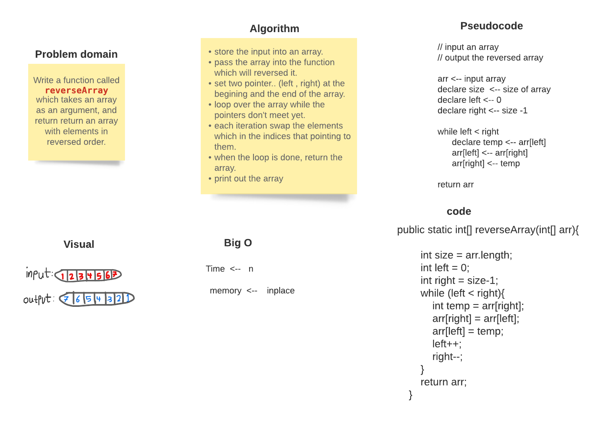
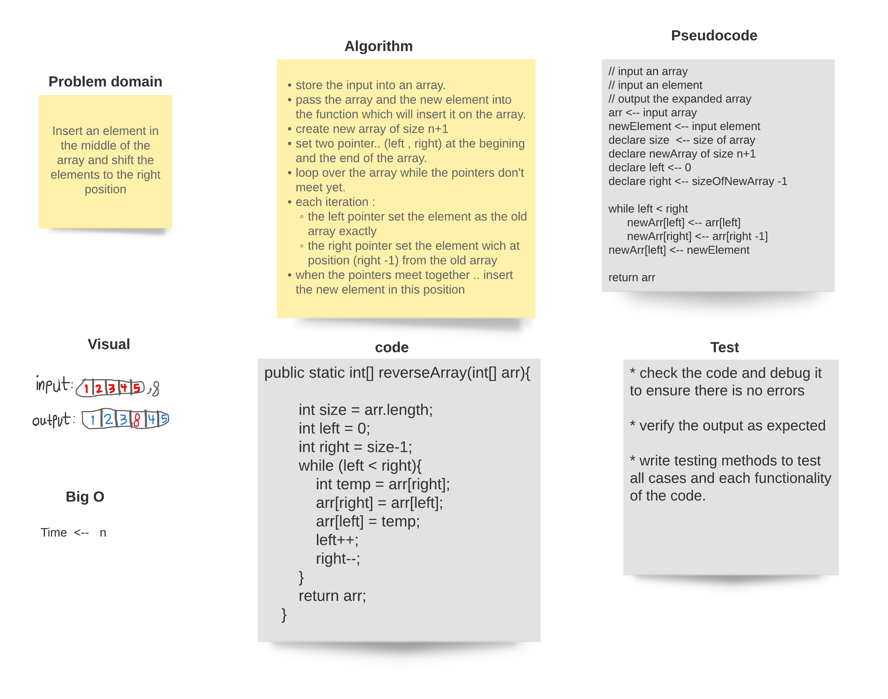
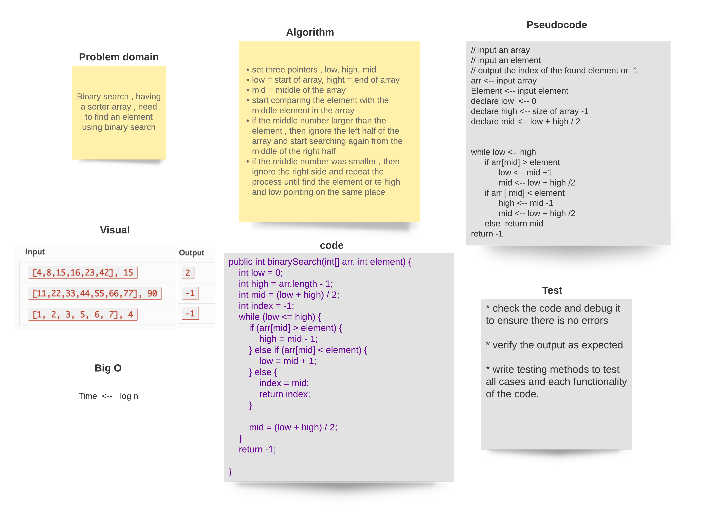
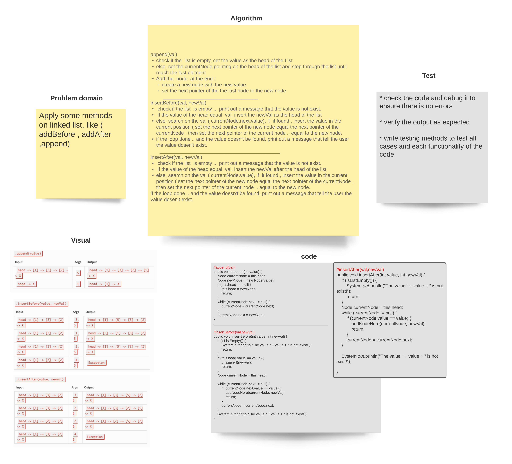
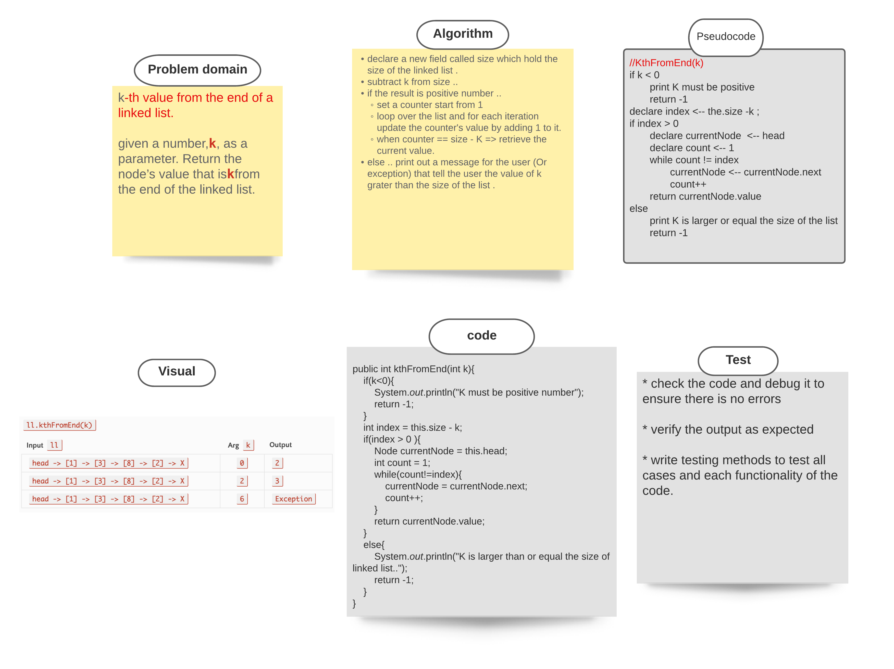
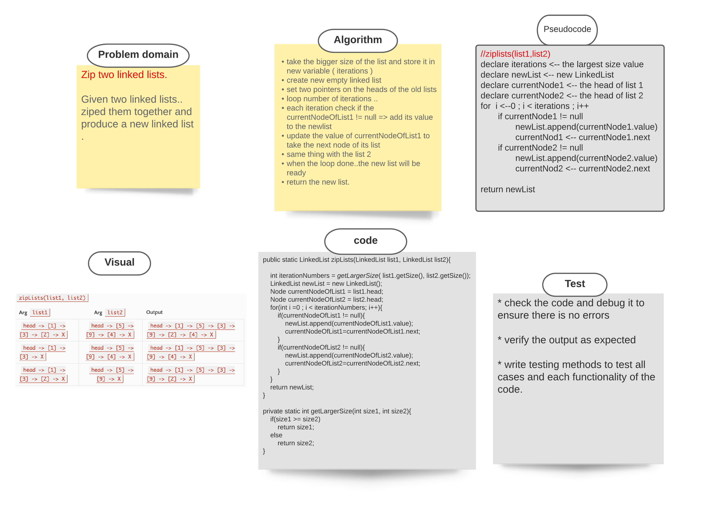
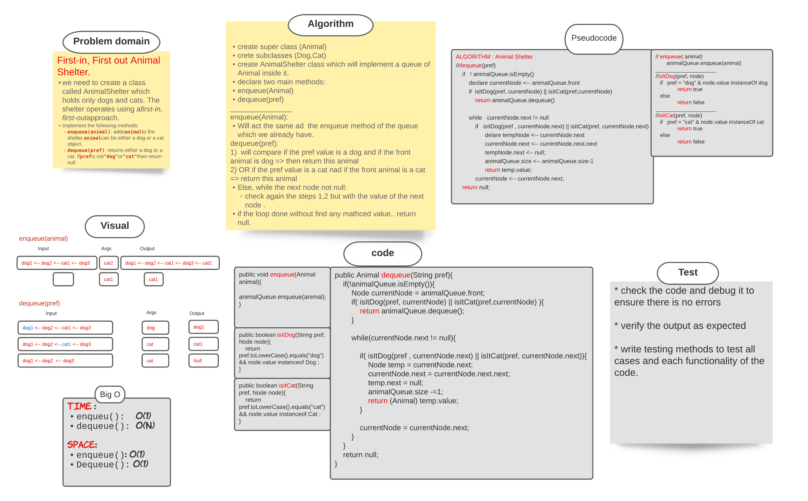

# Reverse an Array 

[Source code =>](https://github.com/MHD22/data-structures-and-algorithms-401/blob/main/challenges/ArrayReverse.java)

print out an array in reverse order

## Challenge

this program should take an array and return it in reverse order.

## Approach & Efficiency

I used two pointers to replace the elements inside the array and go through it until the two pointers meet each other

## Solution

### ----------------------------------------

# Array Shift 

[Source code =>](https://github.com/MHD22/data-structures-and-algorithms-401/blob/main/challenges/ArrayShift.java)

insert an element in the middle of the array and shift the other elements

## Challenge

this program should take an array and an element, then should insert this element in the middle of the array and shift the other elements to the end, finally return the new inserted shifted array.

## Approach & Efficiency

create new array of size n+1 
use two pointers to set the first half of the new array exactly as the first half of the old one
and set the second half of the new array after one position of the second half of the old array

* when the pointer reach the middle, stop the loop and insert the element.

## Solution

### ----------------------------------------

# Binary search in a sorted 1D array 

[Source code =>](https://github.com/MHD22/data-structures-and-algorithms-401/blob/main/challenges/BinarySearch.java)

find an element in a sorted array using binary search algorithm 

## Challenge

this program should take an array and an element, then should return the index of the array that hold this element if found, else, return -1.

## Approach & Efficiency

start comparing the element with the middle element in the array
if the middle number larger than the element , then ignore the left half of the array and start searching again from the middle of the right half
if the middle number was smaller , then ignore the right side and repeat the process until find the element or te high and low pointing on the same place

## Solution

### ----------------------------------------

# Singly Linked List

[Source code =>](https://github.com/MHD22/data-structures-and-algorithms-401/blob/linked-list/Data-Structures/linkedList/app/src/main/java/linkedList/LinkedList.java)

You can create Linked list and manipulate it.

## Challenge

writing methods to insert elements in the list, search on specific elements and print the list as a string.

## Approach & Efficiency

There are two main classes ( Node , LinkedList ), each Node has two fields (value, next node)
and the LinkedList has one field which is the (head node)
head will pointing always to the first node of the list, when you need to add value to list, it will take the head place and pointing to the old head.
The time complexity of inserting a value is : `O(1)`
The time complexity of search on a value is : `O(n)`

## API

1. `insert(value);` will insert the passed value as a new head of the list and make its next pointer pointing on the old head.
2. `includes(value);` will search through the list on the passed value, if it find the value .. the method will return true. else, will return false.
3. `toString();` will print out the whole linked list as a string to the user.

### ----------------------------------------

# Singly Linked List, add more implementations.

[Source code =>](https://github.com/MHD22/data-structures-and-algorithms-401/blob/linked-list/Data-Structures/linkedList/app/src/main/java/linkedList/LinkedList.java)

# Challenge Summary

More implementaitons on linked list, like (insert before, insert after, append).

## Challenge Description

Need add the following methods:

* `addBefore(val, newVal)`: to search and add a new value before a specific one.
* `addAfter(val, newVal)`: to search and add a new value after a specific one.
* `append(val)`: to add a new value to the end of the list.

## Approach & Efficiency

* with the (addBefore AND addAfter) methods, will start from the head and search on the specific value, if it found.. add the new value before or after it. If not, then print out a message or exception that tell the user the value is not exist.

* the append method: start from head and step through the last element, then add the new value there.

## Solution

### ----------------------------------------

# Singly Linked List, KthFromEnd(k)

[Source code =>](https://github.com/MHD22/data-structures-and-algorithms-401/blob/linked-list/Data-Structures/linkedList/app/src/main/java/linkedList/LinkedList.java)

# Challenge Summary

declare a method to find the element of the list that is `K` from the end of the list. 

## Challenge Description

Need add the following methods:

* `KthFromEnd(k)`
K must be smaller than the size of the list. 
this method should search during the list and retrieve the element that K from the end of the list.

## Approach & Efficiency

* declare a new field called size which hold the size of the linked list.
subtract k from size and store the result in index.. 
if the index is positive number .. 
set a counter start from 1 
loop over the list and for each iteration update the counter's value by adding 1 to it.
when counter == index (size - K ) => retrieve the current value.
else .. print out a message for the user (Or exception) that tell the user the value of k grater than the size of the list .

## Solution

### ----------------------------------------

# Singly Linked List, zipLists(list1, list2)

[Source code =>](https://github.com/MHD22/data-structures-and-algorithms-401/blob/linked-list/Data-Structures/linkedList/app/src/main/java/linkedList/LinkedList.java)

# Challenge Summary

declare a method to zipped two list together into new one. 

## Challenge Description

Need add the following methods:

* `zipLists(list1, list2)`
this method should take two linked list and produce a new one which contain the all elements of them.

## Approach & Efficiency

* take the bigger size of the list and store it in new variable ( iterations )
* create new empty linked list
* set two pointers on the heads of the old lists
* loop number of iterations ..
  * each iteration check if the currentNodeOfList1 != null => add its value to the newlist
  * update the value of currentNodeOfList1 to take the next node of its list
  * same thing with the list 2
* when the loop done..the new list will be ready
* return the new list.

## Solution

### ----------------------------------------

# Stacks and Queues
[Source code =>](https://github.com/MHD22/data-structures-and-algorithms-401/blob/linked-list/Data-Structures/stacksandqueues/app/src/main/java/stacksandqueues)

>This app must implement the Stack and Queue data structures.

## Challenge

implement the methods related to manipulate a stack and queue successfully with any type of elements inside them.

## Approach & Efficiency

* create a Node class which take a value (whatever its type ) and the next properties.
* create a stack class and add the required and the appropriate methods to it.
* add the top and size fields to the stack .. top will always pointing to the top values of the stack 
* if the stack was empty.. the top will point on null.

* create a queue class and add the required and the appropriate methods to it.
* add the front, rear, and size field to this class..
* front will pointing on the oldest element entered the queue and the rear will pointin on the newest one.
* When dequeue from the stack will return the front element.
* when enqueue to the stack will add as a rear element.

## API

***For stack:***

* `push(T value)` => will add a value into the top of the stack.
* `pop()` => will pop up the top value of the stack and return it to the user.
* `peek()` => will return the value of the top of the stack without remove it from the stack.
* `isEmpty()` => will return true if the stack is empty, otherwise.. false.

***For queue:***

* `enqueue(T value)` => will add a value into the front of the queue.
* `dequeue()`=> will dequeue out the rear value of the queue and return it to the user.
* `peek()` => will return the rear value of the queue without remove it from the queue.
* `isEmpty()` => will return true if the queue is empty, otherwise.. false.

### ----------------------------------------

# PseudoQueue

[Source code =>](https://github.com/MHD22/data-structures-and-algorithms-401/blob/linked-list/Data-Structures/stacksandqueues/app/src/main/java/stacksandqueues)

# Challenge Summary

Implement a queue using two stacks only with methods of( pop, push, peek) 

## Challenge Description

Need add the following methods:

* `dequeue()`
this method should retrieve the first element of the queue (front).
* `enqueue(value)`
this method should add the value to the end of the queue (rear).

## Approach & Efficiency

* create a class (PseudoQueue)
* create two stacks .. primary and secondary one. when a PseudoQueue is instaniated.
* declare two main methods..(enqueue, dequeue)
* Enqueue method:
  * just push into the primary stack.
* dequeue method:
  * move the contents of the primary stack to the secondary one.
  * pop the top value from the secondary stack
  * move the contents from the secondary stack to the primary one
  * return the poped value.

## Solution

### ----------------------------------------

# Animal Shelter

[Source code =>](https://github.com/MHD22/data-structures-and-algorithms-401/blob/linked-list/Data-Structures/stacksandqueues/app/src/main/java/stacksandqueues)

# Challenge Summary

First-in, First out Animal Shelter.

## Challenge Description

Need add the following methods:

* `enqueue(Animal)`
this method should add an Animal (Dog OR Cat) into the queue which represents the Animal shelter.
* `dequeue(pref)`
this method should retrieve the pref type of Animal (Dog Or Cat) which enter the queue first.

## Approach & Efficiency

* ***enqueue(Animal):*** 
  * Will act the same ad  the enqueue method of the queue which we already have.

* ***dequeue(pref):***

1. will compare if the pref value is a dog and if the front animal is dog => then return this animal
2. OR if the pref value is a cat nad if the front animal is a cat => return this animal

* Else, while the next node not null:
check again the steps `1,2` but with the value of the `next node` .
* if the loop done without find any mathced value.. return null.

## Solution

### ----------------------------------------