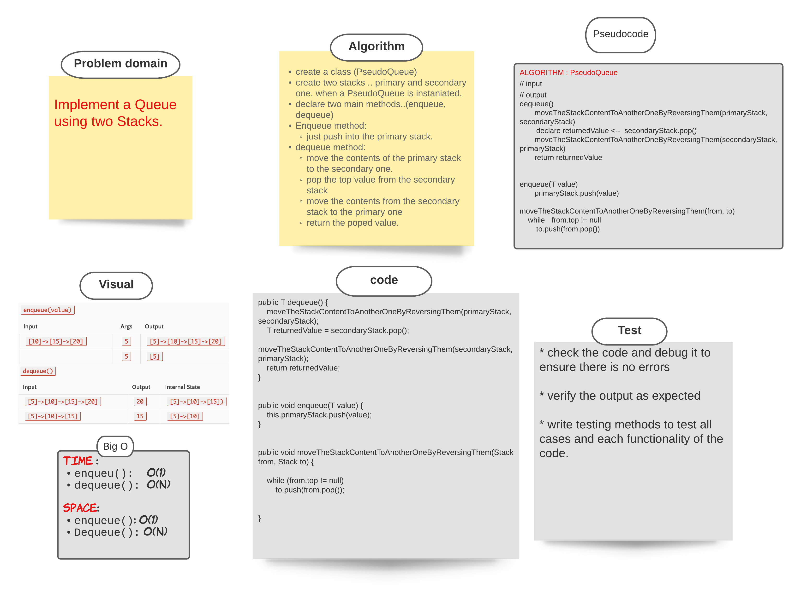
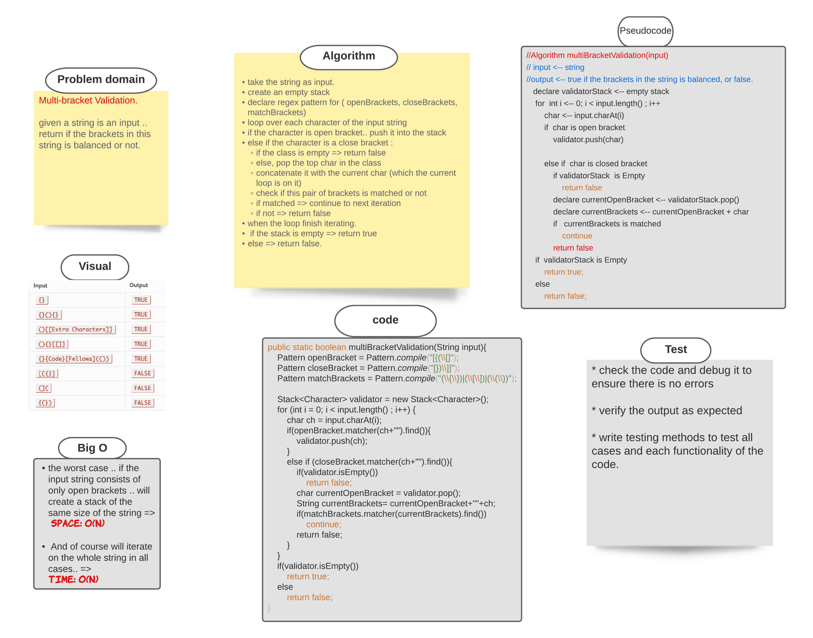
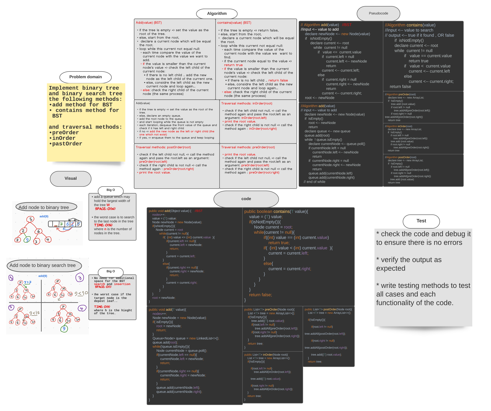
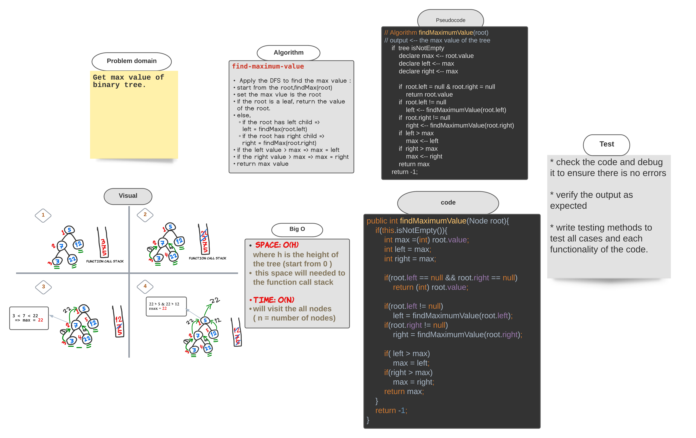
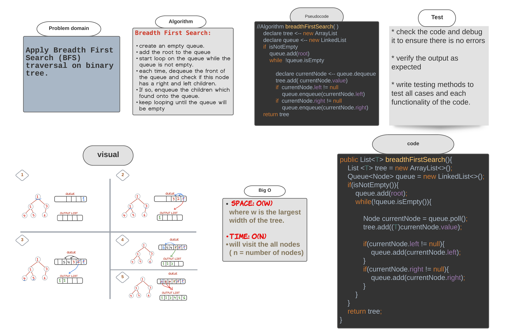
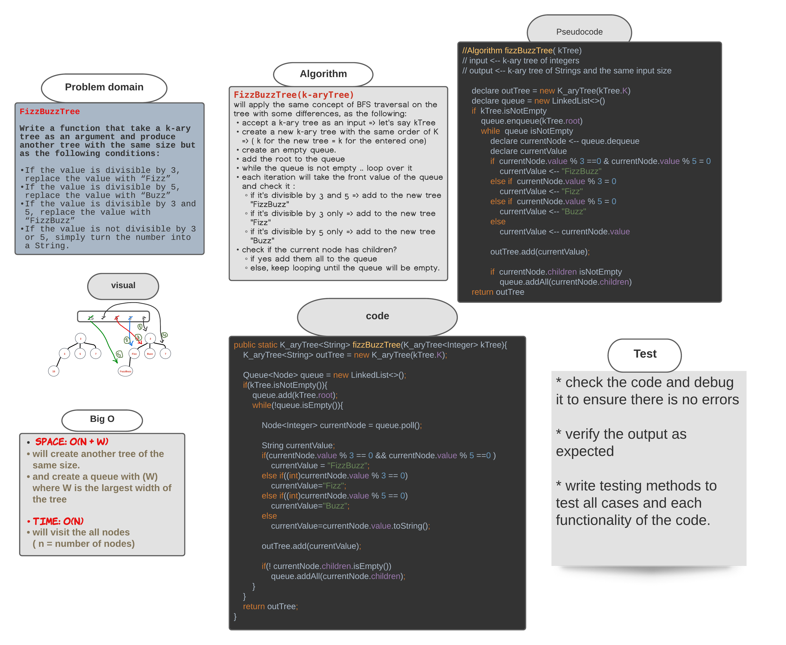
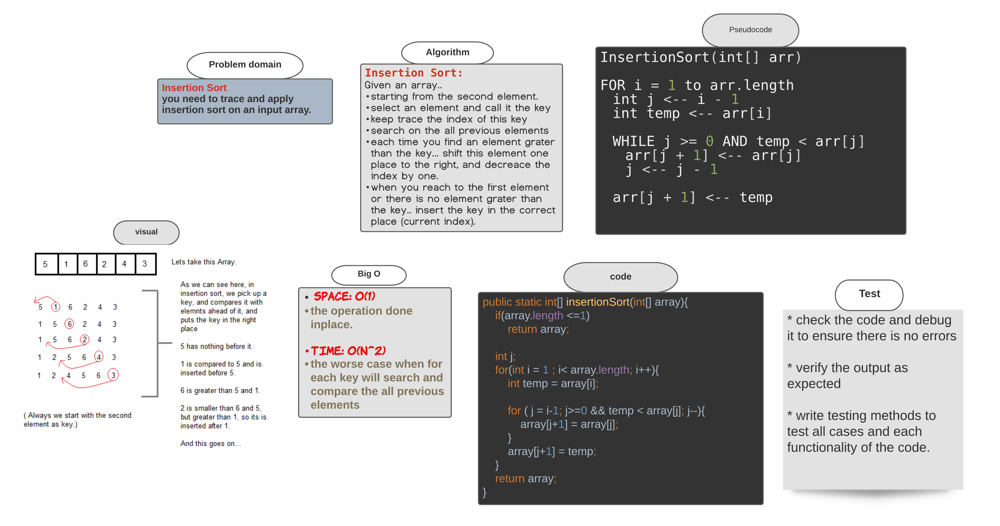

# Reverse an Array 

[Source code =>](https://github.com/MHD22/data-structures-and-algorithms-401/blob/main/challenges/ArrayReverse.java)

print out an array in reverse order

## Challenge

this program should take an array and return it in reverse order.

## Approach & Efficiency

I used two pointers to replace the elements inside the array and go through it until the two pointers meet each other

## Solution

### ----------------------------------------

# Array Shift 

[Source code =>](https://github.com/MHD22/data-structures-and-algorithms-401/blob/main/challenges/ArrayShift.java)

insert an element in the middle of the array and shift the other elements

## Challenge

this program should take an array and an element, then should insert this element in the middle of the array and shift the other elements to the end, finally return the new inserted shifted array.

## Approach & Efficiency

create new array of size n+1 
use two pointers to set the first half of the new array exactly as the first half of the old one
and set the second half of the new array after one position of the second half of the old array

* when the pointer reach the middle, stop the loop and insert the element.

## Solution

### ----------------------------------------

# Binary search in a sorted 1D array 

[Source code =>](https://github.com/MHD22/data-structures-and-algorithms-401/blob/main/challenges/BinarySearch.java)

find an element in a sorted array using binary search algorithm 

## Challenge

this program should take an array and an element, then should return the index of the array that hold this element if found, else, return -1.

## Approach & Efficiency

start comparing the element with the middle element in the array
if the middle number larger than the element , then ignore the left half of the array and start searching again from the middle of the right half
if the middle number was smaller , then ignore the right side and repeat the process until find the element or te high and low pointing on the same place

## Solution

### ----------------------------------------

# Singly Linked List

[Source code =>](https://github.com/MHD22/data-structures-and-algorithms-401/blob/linked-list/Data-Structures/linkedList/app/src/main/java/linkedList/LinkedList.java)

You can create Linked list and manipulate it.

## Challenge

writing methods to insert elements in the list, search on specific elements and print the list as a string.

## Approach & Efficiency

There are two main classes ( Node , LinkedList ), each Node has two fields (value, next node)
and the LinkedList has one field which is the (head node)
head will pointing always to the first node of the list, when you need to add value to list, it will take the head place and pointing to the old head.
The time complexity of inserting a value is : `O(1)`
The time complexity of search on a value is : `O(n)`

## API

1. `insert(value);` will insert the passed value as a new head of the list and make its next pointer pointing on the old head.
2. `includes(value);` will search through the list on the passed value, if it find the value .. the method will return true. else, will return false.
3. `toString();` will print out the whole linked list as a string to the user.

### ----------------------------------------

# Singly Linked List, add more implementations.

[Source code =>](https://github.com/MHD22/data-structures-and-algorithms-401/blob/linked-list/Data-Structures/linkedList/app/src/main/java/linkedList/LinkedList.java)

# Challenge Summary

More implementaitons on linked list, like (insert before, insert after, append).

## Challenge Description

Need add the following methods:

* `addBefore(val, newVal)`: to search and add a new value before a specific one.
* `addAfter(val, newVal)`: to search and add a new value after a specific one.
* `append(val)`: to add a new value to the end of the list.

## Approach & Efficiency

* with the (addBefore AND addAfter) methods, will start from the head and search on the specific value, if it found.. add the new value before or after it. If not, then print out a message or exception that tell the user the value is not exist.

* the append method: start from head and step through the last element, then add the new value there.

## Solution

### ----------------------------------------

# Singly Linked List, KthFromEnd(k)

[Source code =>](https://github.com/MHD22/data-structures-and-algorithms-401/blob/linked-list/Data-Structures/linkedList/app/src/main/java/linkedList/LinkedList.java)

# Challenge Summary

declare a method to find the element of the list that is `K` from the end of the list. 

## Challenge Description

Need add the following methods:

* `KthFromEnd(k)`
K must be smaller than the size of the list. 
this method should search during the list and retrieve the element that K from the end of the list.

## Approach & Efficiency

* declare a new field called size which hold the size of the linked list.
subtract k from size and store the result in index.. 
if the index is positive number .. 
set a counter start from 1 
loop over the list and for each iteration update the counter's value by adding 1 to it.
when counter == index (size - K ) => retrieve the current value.
else .. print out a message for the user (Or exception) that tell the user the value of k grater than the size of the list .

## Solution

### ----------------------------------------

# Singly Linked List, zipLists(list1, list2)

[Source code =>](https://github.com/MHD22/data-structures-and-algorithms-401/blob/linked-list/Data-Structures/linkedList/app/src/main/java/linkedList/LinkedList.java)

# Challenge Summary

declare a method to zipped two list together into new one. 

## Challenge Description

Need add the following methods:

* `zipLists(list1, list2)`
this method should take two linked list and produce a new one which contain the all elements of them.

## Approach & Efficiency

* take the bigger size of the list and store it in new variable ( iterations )
* create new empty linked list
* set two pointers on the heads of the old lists
* loop number of iterations ..
  * each iteration check if the currentNodeOfList1 != null => add its value to the newlist
  * update the value of currentNodeOfList1 to take the next node of its list
  * same thing with the list 2
* when the loop done..the new list will be ready
* return the new list.

## Solution

### ----------------------------------------

# Stacks and Queues
[Source code =>](https://github.com/MHD22/data-structures-and-algorithms-401/tree/main/Data-Structures/stacksandqueues/app/src/main/java/stacksandqueues)

>This app must implement the Stack and Queue data structures.

## Challenge

implement the methods related to manipulate a stack and queue successfully with any type of elements inside them.

## Approach & Efficiency

* create a Node class which take a value (whatever its type ) and the next properties.
* create a stack class and add the required and the appropriate methods to it.
* add the top and size fields to the stack .. top will always pointing to the top values of the stack 
* if the stack was empty.. the top will point on null.

* create a queue class and add the required and the appropriate methods to it.
* add the front, rear, and size field to this class..
* front will pointing on the oldest element entered the queue and the rear will pointin on the newest one.
* When dequeue from the stack will return the front element.
* when enqueue to the stack will add as a rear element.

## API

***For stack:***

* `push(T value)` => will add a value into the top of the stack.
* `pop()` => will pop up the top value of the stack and return it to the user.
* `peek()` => will return the value of the top of the stack without remove it from the stack.
* `isEmpty()` => will return true if the stack is empty, otherwise.. false.

***For queue:***

* `enqueue(T value)` => will add a value into the front of the queue.
* `dequeue()`=> will dequeue out the rear value of the queue and return it to the user.
* `peek()` => will return the rear value of the queue without remove it from the queue.
* `isEmpty()` => will return true if the queue is empty, otherwise.. false.

### ----------------------------------------

# PseudoQueue

[Source code =>](https://github.com/MHD22/data-structures-and-algorithms-401/blob/linked-list/Data-Structures/stacksandqueues/app/src/main/java/stacksandqueues)

# Challenge Summary

Implement a queue using two stacks only with methods of( pop, push, peek) 

## Challenge Description

Need add the following methods:

* `dequeue()`
this method should retrieve the first element of the queue (front).
* `enqueue(value)`
this method should add the value to the end of the queue (rear).

## Approach & Efficiency

* create a class (PseudoQueue)
* create two stacks .. primary and secondary one. when a PseudoQueue is instaniated.
* declare two main methods..(enqueue, dequeue)
* Enqueue method:
  * just push into the primary stack.
* dequeue method:
  * move the contents of the primary stack to the secondary one.
  * pop the top value from the secondary stack
  * move the contents from the secondary stack to the primary one
  * return the poped value.

## Solution

### ----------------------------------------

# Animal Shelter

[Source code =>](https://github.com/MHD22/data-structures-and-algorithms-401/blob/fifo-animal-shelter/challenges/utilities/app/src/main/java/utilities/AnimalShelter.java)

# Challenge Summary

First-in, First out Animal Shelter.

## Challenge Description

Need add the following methods:

* `enqueue(Animal)`
this method should add an Animal (Dog OR Cat) into the queue which represents the Animal shelter.
* `dequeue(pref)`
this method should retrieve the pref type of Animal (Dog Or Cat) which enter the queue first.

## Approach & Efficiency

* ***enqueue(Animal):*** 
  * Will act the same ad  the enqueue method of the queue which we already have.

* ***dequeue(pref):***

1. will compare if the pref value is a dog and if the front animal is dog => then return this animal
2. OR if the pref value is a cat nad if the front animal is a cat => return this animal

* Else, while the next node not null:
check again the steps `1,2` but with the value of the `next node` .
* if the loop done without find any mathced value.. return null.

## Solution

### ----------------------------------------

# Multi Bracket validator

[Source code =>](https://github.com/MHD22/data-structures-and-algorithms-401/blob/main/challenges/utilities/app/src/main/java/utilities/MultiBracketValidation.java)

# Challenge Summary

the function should take a string as its only argument, and should return a boolean representing whether or not the brackets in the string are balanced.

## Challenge Description

Need add the following method:

* `multiBracketValidation(input)`
this method should take an input as a string.. and check if this string is balanced or not.

* Balanced mean each open bracket inside the string must has an appropriete close bracket.
the bracket types:

* Round Brackets : `()`
* Square Brackets : `[]`
* Curly Brackets : `{}`

## Approach & Efficiency

* take the string as input.
* create an empty stack 
* declare regex pattern for ( openBrackets, closeBrackets, matchBrackets)
* loop over each character of the input string 
* if the character is open bracket.. push it into the stack
* else if the character is a close bracket : 
  * if the class is empty => return false
  * else, pop the top char in the class
  * concatenate it with the current char (which the current loop is on it)
  * check if this pair of brackets is matched or not
  * if matched => continue to next iteration
  * if not => return false
* when the loop finish iterating.
* if the stack is empty => return true
* else => return false.

## Solution

### ----------------------------------------

# Trees

[Source code =>](https://github.com/MHD22/data-structures-and-algorithms-401/tree/main/Data-Structures/tree/app/src/main/java/tree)

# Challenge Summary

Implement Binary tree, and Binary Search Tree (BST)

## Challenge Description

Need add the following method:

* `add(value)`
this method should take an input value.. and add it to the tree in the first appropriate place.
* `add(value)` for (BST)
this method should take an input value.. and add it to the tree in the first appropriate place by apply the binary tree search.
* `contains(value)` for (BST)
this method should take an input value.. and return true if the value exist in the binary search tree, otherwise.. return false.
* `preOrder(root)` 
this method should traverse the tree in ***PreOreder*** way and return a list of values of the tree.
* `inOrder(root)` 
this method should traverse the tree in ***InOrder*** way and return a list of values of the tree.
* `postOrder(root)` 
this method should traverse the tree in ***PostOreder*** way and return a list of values of the tree.

## Approach & Efficiency

***Add(value) (BST)***

* if the tree is empty => set the value as the root of the tree.
* else, start from the root,
* declare a current node which will be equal the root.
* loop while this current not equal null:
* each time compare the value of the current node with the value we want to add.
  * if the value is smaller than the current node's value => check the left child of the current node:
    * if there is no left child .. add the new node as the left child of the current one.
    * else, considre the left child as the new current node and loop again...
  * else: check the right child of the current node (the same process)

###### __________

***Add(value) ***

* if the tree is empty => set the value as the root of the tree.
* else, declare an empty queue.
* add the root node to the queue
* and start looping while the queue is not empty
* each iteration, dequeue the front value of the queue and check if it has left and right child
  * if no => add the new node as the left or right child (the one which not exist)
  * if yes, => enqueue them to the queue and keep looping 

###### __________

***contains(value) (BST)***

* if the tree is empty => return false,
* else, start from the root,
* declare a current node which will be equal the root.
* loop while this current not equal null:
* each time compare the value of the current node with the value we  want to find.
  * if the current node equal to the value => return true
  * if the value is smaller than the current node's value => check the left child of the current node:
    * if there is no left child .. return false
    * else, considre the left child as the new current node and loop again...
  * else: check the right child of the current node (the same process)

###### __________

***Traversal methods: inOrder(root)*** 

* check if the left child not null, => call the method again and pass the root.left as an argument: inOrder(root.left)
* print the root value.
* check if the right child is not null => call the method again : inOrder(root.right)

###### __________

***Traversal methods: postOrder(root) ***

* check if the left child not null, => call the method again and pass the root.left as an argument: preOrder(root.left)
* check if the right child is not null => call the method again : preOrder(root.right)
* print the root value.

###### __________

***Traversal methods: preOrder(root) ***

* print the root value.
* check if the left child not null, => call the method again and pass the root.left as an argument: preOrder(root.left)
* check if the right child is not null => call the method again : preOrder(root.right)

###### __________

## Solution

### ----------------------------------------

# Trees: FindMaximumValue 

[Source code =>](https://github.com/MHD22/data-structures-and-algorithms-401/blob/main/Data-Structures/tree/app/src/main/java/tree/BinaryTree.java)

# Challenge Summary

Implement a method to find the max value of a binary tree.

## Challenge Description

Need add the following method:

* `finMaximumValue(root)`
this method should return an integer number which is the max value of the tree.

## Approach & Efficiency

***find-maximum-value***

**Apply the DFS to find the max value :**

* start from the root,findMax(root)
* set the max vlue is the root
* if the root is a leaf, `return` the value of the root.
* else, 
  * if the root has left child => left = findMax(root.left)
  * if the root has right child => right = findMax(root.right)
  * if the left value > max => max = left
  * if the right value > max => max = right
  * return max value

## Solution

### ----------------------------------------

# Trees: Breadth First Search Traversal method 

[Source code =>](https://github.com/MHD22/data-structures-and-algorithms-401/blob/main/Data-Structures/tree/app/src/main/java/tree/BinaryTree.java)

# Challenge Summary

Implement a method to traverse the binary tree in A BFS order.

## Challenge Description

Need add the following method:

* `breadthFirstSearch()`
this method should return list which contain the all values of the tree in the BFS order.

## Approach & Efficiency

***Breadth First Search (BFS):***

* create an empty queue.
* add the root to the queue
* start loop on the queue while the queue is not empty.
* each time, dequeue the front of the queue and check if this node has a right and left children.
* If so, enqueue the children which found onto the queue.
* keep looping until the queue will be empty

## Solution

### ----------------------------------------

# Trees: FizzBuzzTree(k-aryTree) 

[Source code =>](https://github.com/MHD22/data-structures-and-algorithms-401/blob/main/Data-Structures/tree/app/src/main/java/tree/FizzBuzzTree.java)

# Challenge Summary

* Write a function that take a k-ary tree as an argument and produce another tree with the same size 

## Challenge Description

Need add the following method:

* `fizzBuzzTree(k-aryTree)`
this method will take a k-ary tree as an argument and produce another tree with the same size but as the following conditions:

* If the value is divisible by 3, replace the value with “Fizz”
* If the value is divisible by 5, replace the value with “Buzz”
* If the value is divisible by 3 and 5, replace the value with “FizzBuzz”
* If the value is not divisible by 3 or 5, simply turn the number into a String.

## Approach & Efficiency

***FizzBuzzTree(k-aryTree)***

> will apply the same concept of BFS traversal on the tree with some differences, as the following:

* accept a k-ary tree as an input => let's say kTree
* create a new k-ary tree with the same order of K => ( k for the new tree = k for the entered one)
* create an empty queue.
* add the root to the queue
* while the queue is not empty .. loop over it
* each iteration will take the front value of the queue and check it :
  * if it's divisible by 3 and 5 => add to the new tree "FizzBuzz"
  * if it's divisible by 3 only => add to the new tree "Fizz"
  * if it's divisible by 5 only => add to the new tree "Buzz"
* check if the current node has children?
* if yes add them all to the queue
* else, keep looping until the queue will be empty.

## Solution

### ----------------------------------------

# Insertion sort 

[Source code =>]()

# Challenge Summary

* Write a function that take an array as an argument and sort it in the insertion method then return the sorted array. 

## Challenge Description

Need add the following method:

* `insertionSort(array)`
this method will take an array as an argument and and sort it in the insertion method then return the sorted array, and will care about the following cases.

* If the array is empty => return an empty array.
* If the array size is one => return the array immediately
* else.. sort the array inplace and return it.

## Approach & Efficiency

***Insertion Sort:***

Given an array..
* starting from the second element.
* select an element and call it the key
* keep trace the index of this key
* search on the all previous elements
* each time you find an element grater than the key... shift this element one place to the right, and decreace the index by one.
* when you reach to the first element or there is no element grater than the key.. insert the key in the correct place (current index). 

## Solution ( whiteboared ):

## Solution (Blog):
[insertion sort blog =>]()

### ----------------------------------------

# Merge Sort 

[Source code =>]()

# Challenge Summary

* Write a function that take an array as an argument and sort it using Marge sort algorithm then return the sorted array. 

## Challenge Description

Need add the following method:

* `mergeSort(array)`
this method will take an array as an argument and and sort it using Marge sort algorithm then return the sorted array. and will care about the following cases.

  * If the array is empty => return an empty array.
  * If the array size is one => return the array immediately
  * else.. sort the array inplace and return it.

* `merge(left,right,arr)`
  * this method will take three arrays as arguments and merge the first two together into the third one 
  (merge left and right into => arr)

## Approach & Efficiency

***Merge Sort:***

Given an array..

* divide the array into two halves (left and right)
* call the function again for each half
* when the size is one return the array
* when the left and right parts are done.. merge them together..
* merge by select the smaller element from each side and add it to the original array.
* return the array.

## Solution (Blog):
[insertion sort blog =>]()

### ----------------------------------------

# Quick Sort 

[Source code =>]()

# Challenge Summary

* Write a function that take an array as an argument and sort it using Quick sort algorithm then return the sorted array. 

## Challenge Description

Need add the following method:

* `quickSort(array,left,right)`
this method will take the (array , left , right) as an argument and  sort it using Quick sort algorithm then return the sorted array. and will care about the following cases.

  * If the array is empty => return an empty array.
  * If the array size is one => return the array immediately
  * else.. sort the array inplace and return it.

* `partition(arr,left,right)`
  * this method will put the pivot on its correct order where all the smallest elements than it will be on its left side and all the largest elements on its right side.. then, return the position of the pivot.

* `swap(arr,first,second)`
  * this method will simply swap the element in the first index with the element in the second index.

## Approach & Efficiency

***Merge Sort:***

Given an array..

* if the left less than the right.
* calculate the positiopn of the pivot 
* divide the array into two parts.. one before the pivot and the second after it.. then re call the function quickSort for each part
* when the call stack is empty.. the sort process is done and the array will be sorted. 

## Solution (Blog):
[quick sort blog =>]()

### ----------------------------------------

