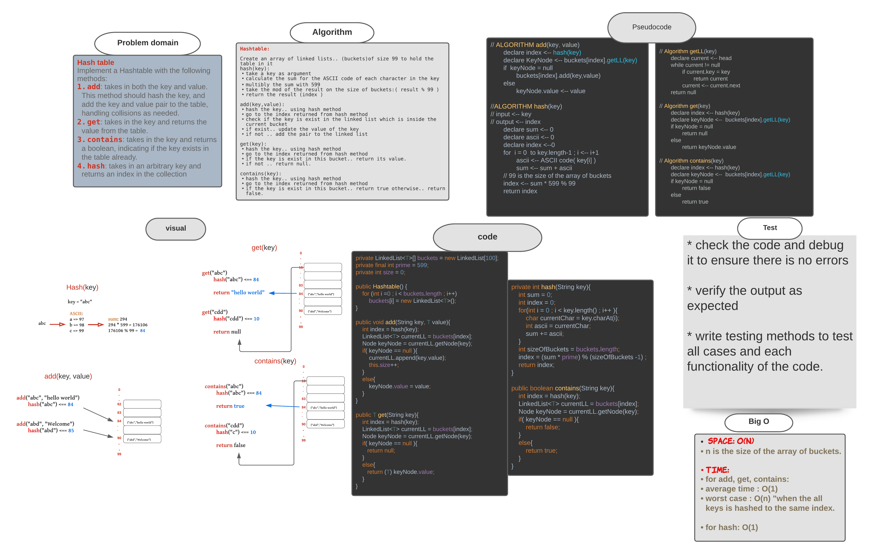

# Challenges list..

* This table contains the all challenges, data structures, and algorithms that I applied using Java programming language.

Each link will take you to a seperate file which contains:

* The description of the (challenge, data structure, or algorithm).
* And the approach that used to implement it.
* Efficiency of this algorithm, and the whiteboard of this challenge.

|  Challenge:  |
|--------------|
| [reverse an array =>](https://github.com/MHD22/data-structures-and-algorithms-401/blob/main/challenges-description-files/reverseAnArray.md) | 
| [Array shift =>](https://github.com/MHD22/data-structures-and-algorithms-401/blob/main/challenges-description-files/arrayShift.md) | 
| [Binary search in a sorted 1D array =>](https://github.com/MHD22/data-structures-and-algorithms-401/blob/main/challenges-description-files/binarySearchIn_1D_Array.md) | 
| [Singly Linked List =>](https://github.com/MHD22/data-structures-and-algorithms-401/blob/main/challenges-description-files/singlyLinkedList.md) | 
| [Singly Linked List Part2 (additional methods) =>](https://github.com/MHD22/data-structures-and-algorithms-401/blob/main/challenges-description-files/singlyLinkedList2.md) |
| [Singly Linked List, KthFromEnd(k) =>](https://github.com/MHD22/data-structures-and-algorithms-401/blob/main/challenges-description-files/singlyLinkedList_KthFromEnd.md) |
| [Singly Linked List, zipLists(list1, list2) =>](https://github.com/MHD22/data-structures-and-algorithms-401/blob/main/challenges-description-files/singlyLinkedList_zipLists.md) |
| [Stacks and Queues =>](https://github.com/MHD22/data-structures-and-algorithms-401/blob/main/challenges-description-files/stacksAndQueues.md) |
| [PseudoQueue (queue from two stacks) =>](https://github.com/MHD22/data-structures-and-algorithms-401/blob/main/challenges-description-files/pseudoQueue.md) |

### ----------------------------------------

### ----------------------------------------

### ----------------------------------------

### ----------------------------------------

### ----------------------------------------

### ----------------------------------------

### ----------------------------------------

### ----------------------------------------

### ----------------------------------------

# Animal Shelter

[Source code =>](https://github.com/MHD22/data-structures-and-algorithms-401/blob/fifo-animal-shelter/challenges/utilities/app/src/main/java/utilities/AnimalShelter.java)

# Challenge Summary

First-in, First out Animal Shelter.

## Challenge Description

Need add the following methods:

* `enqueue(Animal)`
this method should add an Animal (Dog OR Cat) into the queue which represents the Animal shelter.
* `dequeue(pref)`
this method should retrieve the pref type of Animal (Dog Or Cat) which enter the queue first.

## Approach & Efficiency

* ***enqueue(Animal):*** 
  * Will act the same ad  the enqueue method of the queue which we already have.

* ***dequeue(pref):***

1. will compare if the pref value is a dog and if the front animal is dog => then return this animal
2. OR if the pref value is a cat nad if the front animal is a cat => return this animal

* Else, while the next node not null:
check again the steps `1,2` but with the value of the `next node` .
* if the loop done without find any mathced value.. return null.

## Solution

### ----------------------------------------

# Multi Bracket validator

[Source code =>](https://github.com/MHD22/data-structures-and-algorithms-401/blob/main/challenges/utilities/app/src/main/java/utilities/MultiBracketValidation.java)

# Challenge Summary

the function should take a string as its only argument, and should return a boolean representing whether or not the brackets in the string are balanced.

## Challenge Description

Need add the following method:

* `multiBracketValidation(input)`
this method should take an input as a string.. and check if this string is balanced or not.

* Balanced mean each open bracket inside the string must has an appropriete close bracket.
the bracket types:

* Round Brackets : `()`
* Square Brackets : `[]`
* Curly Brackets : `{}`

## Approach & Efficiency

* take the string as input.
* create an empty stack 
* declare regex pattern for ( openBrackets, closeBrackets, matchBrackets)
* loop over each character of the input string 
* if the character is open bracket.. push it into the stack
* else if the character is a close bracket : 
  * if the class is empty => return false
  * else, pop the top char in the class
  * concatenate it with the current char (which the current loop is on it)
  * check if this pair of brackets is matched or not
  * if matched => continue to next iteration
  * if not => return false
* when the loop finish iterating.
* if the stack is empty => return true
* else => return false.

## Solution

### ----------------------------------------

# Trees

[Source code =>](https://github.com/MHD22/data-structures-and-algorithms-401/tree/main/Data-Structures/tree/app/src/main/java/tree)

# Challenge Summary

Implement Binary tree, and Binary Search Tree (BST)

## Challenge Description

Need add the following method:

* `add(value)`
this method should take an input value.. and add it to the tree in the first appropriate place.
* `add(value)` for (BST)
this method should take an input value.. and add it to the tree in the first appropriate place by apply the binary tree search.
* `contains(value)` for (BST)
this method should take an input value.. and return true if the value exist in the binary search tree, otherwise.. return false.
* `preOrder(root)` 
this method should traverse the tree in ***PreOreder*** way and return a list of values of the tree.
* `inOrder(root)` 
this method should traverse the tree in ***InOrder*** way and return a list of values of the tree.
* `postOrder(root)` 
this method should traverse the tree in ***PostOreder*** way and return a list of values of the tree.

## Approach & Efficiency

***Add(value) (BST)***

* if the tree is empty => set the value as the root of the tree.
* else, start from the root,
* declare a current node which will be equal the root.
* loop while this current not equal null:
* each time compare the value of the current node with the value we want to add.
  * if the value is smaller than the current node's value => check the left child of the current node:
    * if there is no left child .. add the new node as the left child of the current one.
    * else, considre the left child as the new current node and loop again...
  * else: check the right child of the current node (the same process)

###### __________

***Add(value) ***

* if the tree is empty => set the value as the root of the tree.
* else, declare an empty queue.
* add the root node to the queue
* and start looping while the queue is not empty
* each iteration, dequeue the front value of the queue and check if it has left and right child
  * if no => add the new node as the left or right child (the one which not exist)
  * if yes, => enqueue them to the queue and keep looping 

###### __________

***contains(value) (BST)***

* if the tree is empty => return false,
* else, start from the root,
* declare a current node which will be equal the root.
* loop while this current not equal null:
* each time compare the value of the current node with the value we  want to find.
  * if the current node equal to the value => return true
  * if the value is smaller than the current node's value => check the left child of the current node:
    * if there is no left child .. return false
    * else, considre the left child as the new current node and loop again...
  * else: check the right child of the current node (the same process)

###### __________

***Traversal methods: inOrder(root)*** 

* check if the left child not null, => call the method again and pass the root.left as an argument: inOrder(root.left)
* print the root value.
* check if the right child is not null => call the method again : inOrder(root.right)

###### __________

***Traversal methods: postOrder(root) ***

* check if the left child not null, => call the method again and pass the root.left as an argument: preOrder(root.left)
* check if the right child is not null => call the method again : preOrder(root.right)
* print the root value.

###### __________

***Traversal methods: preOrder(root) ***

* print the root value.
* check if the left child not null, => call the method again and pass the root.left as an argument: preOrder(root.left)
* check if the right child is not null => call the method again : preOrder(root.right)

###### __________

## Solution

### ----------------------------------------

# Trees: FindMaximumValue 

[Source code =>](https://github.com/MHD22/data-structures-and-algorithms-401/blob/main/Data-Structures/tree/app/src/main/java/tree/BinaryTree.java)

# Challenge Summary

Implement a method to find the max value of a binary tree.

## Challenge Description

Need add the following method:

* `finMaximumValue(root)`
this method should return an integer number which is the max value of the tree.

## Approach & Efficiency

***find-maximum-value***

**Apply the DFS to find the max value :**

* start from the root,findMax(root)
* set the max vlue is the root
* if the root is a leaf, `return` the value of the root.
* else, 
  * if the root has left child => left = findMax(root.left)
  * if the root has right child => right = findMax(root.right)
  * if the left value > max => max = left
  * if the right value > max => max = right
  * return max value

## Solution

### ----------------------------------------

# Trees: Breadth First Search Traversal method 

[Source code =>](https://github.com/MHD22/data-structures-and-algorithms-401/blob/main/Data-Structures/tree/app/src/main/java/tree/BinaryTree.java)

# Challenge Summary

Implement a method to traverse the binary tree in A BFS order.

## Challenge Description

Need add the following method:

* `breadthFirstSearch()`
this method should return list which contain the all values of the tree in the BFS order.

## Approach & Efficiency

***Breadth First Search (BFS):***

* create an empty queue.
* add the root to the queue
* start loop on the queue while the queue is not empty.
* each time, dequeue the front of the queue and check if this node has a right and left children.
* If so, enqueue the children which found onto the queue.
* keep looping until the queue will be empty

## Solution

### ----------------------------------------

# Trees: FizzBuzzTree(k-aryTree) 

[Source code =>](https://github.com/MHD22/data-structures-and-algorithms-401/blob/main/Data-Structures/tree/app/src/main/java/tree/FizzBuzzTree.java)

# Challenge Summary

* Write a function that take a k-ary tree as an argument and produce another tree with the same size 

## Challenge Description

Need add the following method:

* `fizzBuzzTree(k-aryTree)`
this method will take a k-ary tree as an argument and produce another tree with the same size but as the following conditions:

* If the value is divisible by 3, replace the value with “Fizz”
* If the value is divisible by 5, replace the value with “Buzz”
* If the value is divisible by 3 and 5, replace the value with “FizzBuzz”
* If the value is not divisible by 3 or 5, simply turn the number into a String.

## Approach & Efficiency

***FizzBuzzTree(k-aryTree)***

> will apply the same concept of BFS traversal on the tree with some differences, as the following:

* accept a k-ary tree as an input => let's say kTree
* create a new k-ary tree with the same order of K => ( k for the new tree = k for the entered one)
* create an empty queue.
* add the root to the queue
* while the queue is not empty .. loop over it
* each iteration will take the front value of the queue and check it :
  * if it's divisible by 3 and 5 => add to the new tree "FizzBuzz"
  * if it's divisible by 3 only => add to the new tree "Fizz"
  * if it's divisible by 5 only => add to the new tree "Buzz"
* check if the current node has children?
* if yes add them all to the queue
* else, keep looping until the queue will be empty.

## Solution

### ----------------------------------------

# Insertion sort 

[Source code =>](https://github.com/MHD22/data-structures-and-algorithms-401/blob/main/challenges/insertionSort/lib/src/main/java/insertionSort/InsertionSort.java)

# Challenge Summary

* Write a function that take an array as an argument and sort it in the insertion method then return the sorted array. 

## Challenge Description

Need add the following method:

* `insertionSort(array)`
this method will take an array as an argument and and sort it in the insertion method then return the sorted array, and will care about the following cases.

* If the array is empty => return an empty array.
* If the array size is one => return the array immediately
* else.. sort the array inplace and return it.

## Approach & Efficiency

***Insertion Sort:***

Given an array..
* starting from the second element.
* select an element and call it the key
* keep trace the index of this key
* search on the all previous elements
* each time you find an element grater than the key... shift this element one place to the right, and decreace the index by one.
* when you reach to the first element or there is no element grater than the key.. insert the key in the correct place (current index). 

## Solution ( whiteboared ):

## Solution (Blog):
[insertion sort blog =>](https://github.com/MHD22/data-structures-and-algorithms-401/blob/main/challenges/insertionSort/BLOG.md)

### ----------------------------------------

# Merge Sort 

[Source code =>](https://github.com/MHD22/data-structures-and-algorithms-401/blob/main/challenges/mergeSort/app/src/main/java/mergeSort/MergeSort.java)

# Challenge Summary

* Write a function that take an array as an argument and sort it using Marge sort algorithm then return the sorted array. 

## Challenge Description

Need add the following method:

* `mergeSort(array)`
this method will take an array as an argument and and sort it using Marge sort algorithm then return the sorted array. and will care about the following cases.

  * If the array is empty => return an empty array.
  * If the array size is one => return the array immediately
  * else.. sort the array inplace and return it.

* `merge(left,right,arr)`
  * this method will take three arrays as arguments and merge the first two together into the third one 
  (merge left and right into => arr)

## Approach & Efficiency

***Merge Sort:***

Given an array..

* divide the array into two halves (left and right)
* call the function again for each half
* when the size is one return the array
* when the left and right parts are done.. merge them together..
* merge by select the smaller element from each side and add it to the original array.
* return the array.

## Solution (Blog):
[merge sort blog =>](https://github.com/MHD22/data-structures-and-algorithms-401/blob/main/challenges/mergeSort/BLOG.md)

### ----------------------------------------

# Quick Sort 

[Source code =>](https://github.com/MHD22/data-structures-and-algorithms-401/blob/main/challenges/quickSort/app/src/main/java/quickSort/QuickSort.java)

# Challenge Summary

* Write a function that take an array as an argument and sort it using Quick sort algorithm then return the sorted array. 

## Challenge Description

Need add the following method:

* `quickSort(array,left,right)`
this method will take the (array , left , right) as an argument and  sort it using Quick sort algorithm then return the sorted array. and will care about the following cases.

  * If the array is empty => return an empty array.
  * If the array size is one => return the array immediately
  * else.. sort the array inplace and return it.

* `partition(arr,left,right)`
  * this method will put the pivot on its correct order where all the smallest elements than it will be on its left side and all the largest elements on its right side.. then, return the position of the pivot.

* `swap(arr,first,second)`
  * this method will simply swap the element in the first index with the element in the second index.

## Approach & Efficiency

***Merge Sort:***

Given an array..

* if the left less than the right.
* calculate the positiopn of the pivot 
* divide the array into two parts.. one before the pivot and the second after it.. then re call the function quickSort for each part
* when the call stack is empty.. the sort process is done and the array will be sorted. 

## Solution (Blog):
[quick sort blog =>](https://github.com/MHD22/data-structures-and-algorithms-401/blob/main/challenges/quickSort/BLOG.md)

### ----------------------------------------

# Hashtables

Implement a hashtable to store (key, value) pairs and retrieve the value in a fast way.

## Challenge

write the Java code to implement the hashtable and all its methods( add, get, contains, hash)
to store and retrieve data from this data structure in time complexity `O(1)`
where its method must do the following:

* `add`: takes in both the key and value. This method should hash the key, and add the key and value pair to the table, handling collisions as needed.
* `get`: takes in the key and returns the value from the table.
* `contains`: takes in the key and returns a boolean, indicating if the key exists in the table already.
* `hash`: takes in an arbitrary key and returns an index in the collection

## Approach & Efficiency

* ***Approach:***

Create an array of linked lists.. (buckets)of size `99` to hold the table in it

`hash(key):`

take a key as argument
calculate the sum for the ASCII code of each character in the key 
multibly the sum with `599`, where 599 is a prime number.
take the modulu of the result on the size of buckets:  `( result % 99 )`
return the final result ( index )

`add(key,value):`

hash the key.. using `hash` method 
go to the index returned from hash method in the buckets array.
check if the key is exist in the linked list which is inside the current bucket
if exist.. update the value of this key
if not .. add the pair(key, value) to the linked list

`get(key):`
hash the key.. using hash method 
go to the index returned from hash method
if the key is exist in this bucket.. return its value.
if not .. return null.

`contains(key):`
hash the key.. using hash method 
go to the index returned from hash method
if the key is exist in this bucket.. return true otherwise.. return false.

* ***Efficiency:***

***space: O(N)***

where n is the size of the array of buckets.

***time:*** 

* for add, get, contains:
  * average time : `O(1)`
  * worst case : `O(n)` "when the all keys is hashed to the same index."
* for hash: `O(1)`

## API

* `add(key, value)`: key must be a string, value can be any type of data.
this method will take the key and search in the hashtable on it, if the key is exist, it will update the value of it. else, will add the key and value as a new pair to the hashtable

* `get(key)`: key must be a string.
this method will take the key and search on it inside the hashtable. If the key is exist will return the value of it. else, will return null.

* `contains(key)`: key must be a string.
this method will take the key and search on it inside the hashtable. If the key is exist will return true. else, will return false.

## Solution ( whiteboared ):

