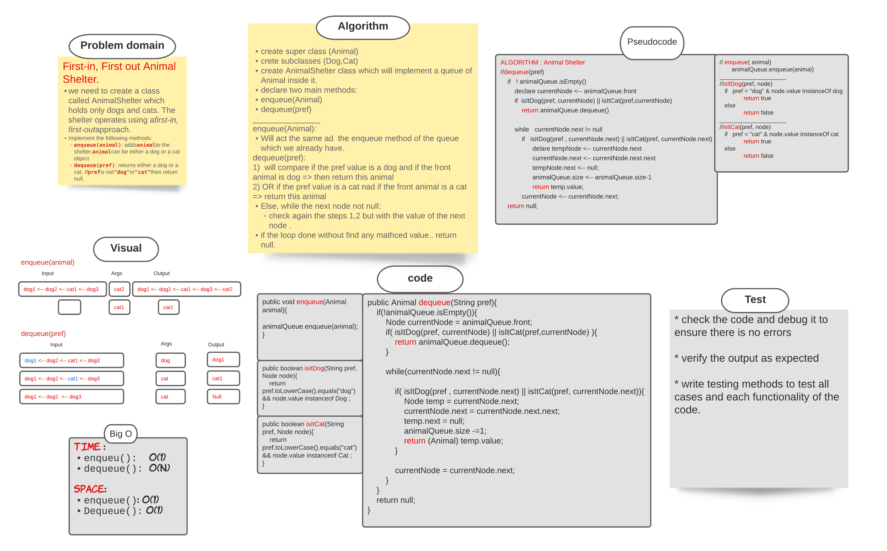

###### [back to main list of challenges](https://github.com/MHD22/data-structures-and-algorithms-401#readme)

# Animal Shelter

[Source code =>](https://github.com/MHD22/data-structures-and-algorithms-401/blob/fifo-animal-shelter/challenges/utilities/app/src/main/java/utilities/AnimalShelter.java)

# Challenge Summary

First-in, First out Animal Shelter.

## Challenge Description

Need add the following methods:

* `enqueue(Animal)`
this method should add an Animal (Dog OR Cat) into the queue which represents the Animal shelter.
* `dequeue(pref)`
this method should retrieve the pref type of Animal (Dog Or Cat) which enter the queue first.

## Approach & Efficiency

* ***enqueue(Animal):*** 
  * Will act the same ad  the enqueue method of the queue which we already have.

* ***dequeue(pref):***

1. will compare if the pref value is a dog and if the front animal is dog => then return this animal
2. OR if the pref value is a cat nad if the front animal is a cat => return this animal

* Else, while the next node not null:
check again the steps `1,2` but with the value of the `next node` .
* if the loop done without find any mathced value.. return null.

## Solution

