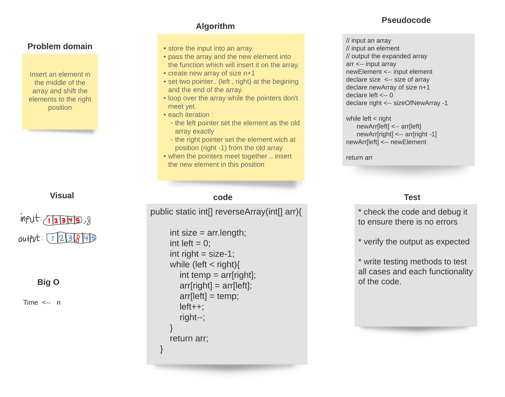

###### [back to main list of challenges](https://github.com/MHD22/data-structures-and-algorithms-401#readme)

# Array Shift 

[Source code =>](https://github.com/MHD22/data-structures-and-algorithms-401/blob/main/challenges/ArrayShift.java)

insert an element in the middle of the array and shift the other elements

## Challenge

this program should take an array and an element, then should insert this element in the middle of the array and shift the other elements to the end, finally return the new inserted shifted array.

## Approach & Efficiency

create new array of size n+1 
use two pointers to set the first half of the new array exactly as the first half of the old one
and set the second half of the new array after one position of the second half of the old array

* when the pointer reach the middle, stop the loop and insert the element.

## Solution

