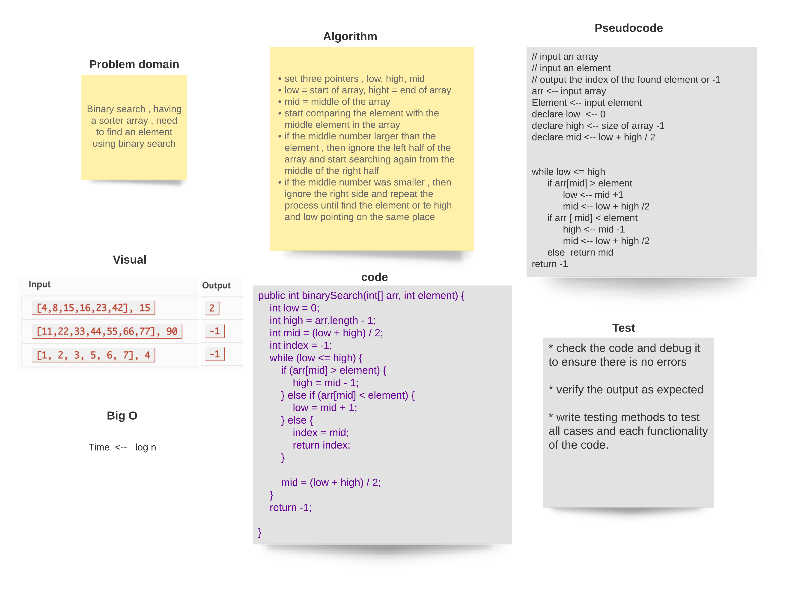

###### [back to main list of challenges](https://github.com/MHD22/data-structures-and-algorithms-401#readme)

# Binary search in a sorted 1D array 

[Source code =>](https://github.com/MHD22/data-structures-and-algorithms-401/blob/main/challenges/BinarySearch.java)

find an element in a sorted array using binary search algorithm 

## Challenge

this program should take an array and an element, then should return the index of the array that hold this element if found, else, return -1.

## Approach & Efficiency

start comparing the element with the middle element in the array
if the middle number larger than the element , then ignore the left half of the array and start searching again from the middle of the right half
if the middle number was smaller , then ignore the right side and repeat the process until find the element or te high and low pointing on the same place

## Solution

