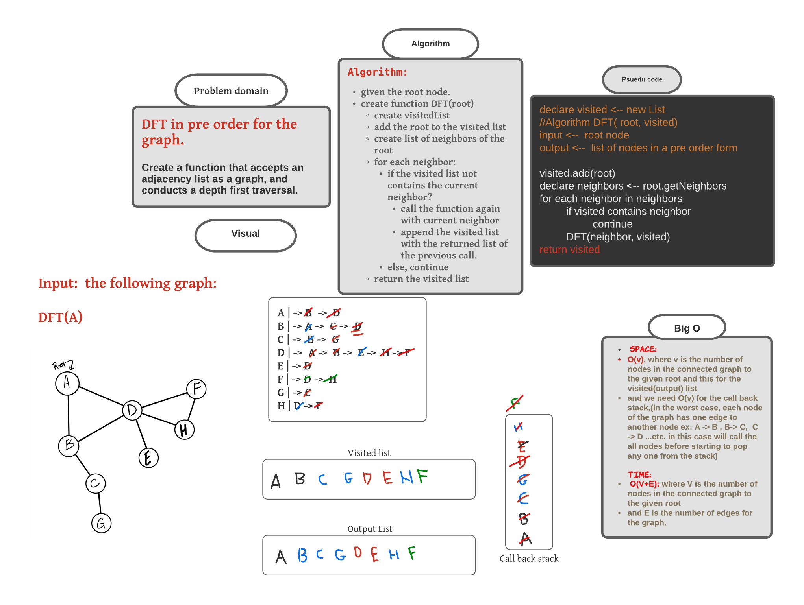

###### [back to main list of challenges](https://github.com/MHD22/data-structures-and-algorithms-401#readme)

# DFT On graph.

[Source code =>](https://github.com/MHD22/data-structures-and-algorithms-401/blob/main/Data-Structures/graph/app/src/main/java/graph/Graph.java)

# Challenge Summary

Implement the Depth First Preorder Traversal on Graph.

## API

* **`DFT(root)`** this method should take the value of root to start the traversing from it, and will return list of strings that represents the order of traversing the all connected nodes to the given root.
***NOTE:*** if the node is not exist will throw an exception (NodeNotFoundException)

## Approach & Efficiency

***Algorithm: DFT(root):***

* given the root node.
* create visitedList
* create function DFT(root, visited)
* add the root to the visited list
* create list of neighbors of the root
* for each neighbor:
  * if the visited list not contains the current neighbor?
    * call the function again with current neighbor
    * append the visited list with the returned list of the previous call.
  * else, continue
* return the visited list

***Efficiency:***

`Time`: 

* `O(V+E)`:
where `V` is the number of nodes connected to the given root, where we need to visit them all.

And `E` is the number of Edges in the graph (or part of graph connected to the root)

`space`:

* `O(V)`:
where `V` is the number of nodes connected to the given root, So we need to create visited list of size (V).

## Whiteboard Process

