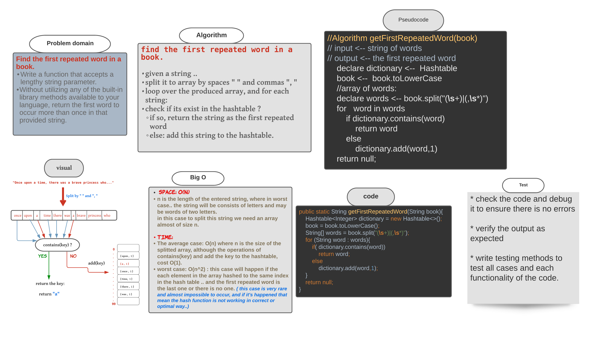

###### [back to main list of challenges](https://github.com/MHD22/data-structures-and-algorithms-401#readme)

# First Repeated Word

[Source code =>]()

# Challenge Summary

Find the first repeated word in a given book (string).

## API

getFirstRepeatedWord(book); book must be a string value, will retrun a string which is the first repeated word in the entered string, if there is no repeated words, will return null.

## Approach & Efficiency

* given a string ..
* split it to array by spaces " " and commas ", "
* loop over the produced array, and for each string:
* check if its exist in the hashtable ? 
* if so, return the string as the first repeated word
* else: add this string to the hashtable.

***Efficiency:***

* space: `O(n)` 
n is the length of the entered string, where in worst case.. the string will be consists of letters and may be words of two letters.in this case to split this string we need an array almost of size n.

* time: 
The **average case:** `O(n)` where n is the size of the splitted array, although the operations of contains(key) and add the key to the hashtable, cost O(1).

**worst case:** `O(n^2)`: this case will happen if the each element in the array hashed to the same index in the hash table .. and the first repeated word is the last one or there is no one. ( this case is very rare and almost impossible to occur, and if it's happened that mean the hash function is not working in correct or optimal way..). 

## Whiteboard Process

