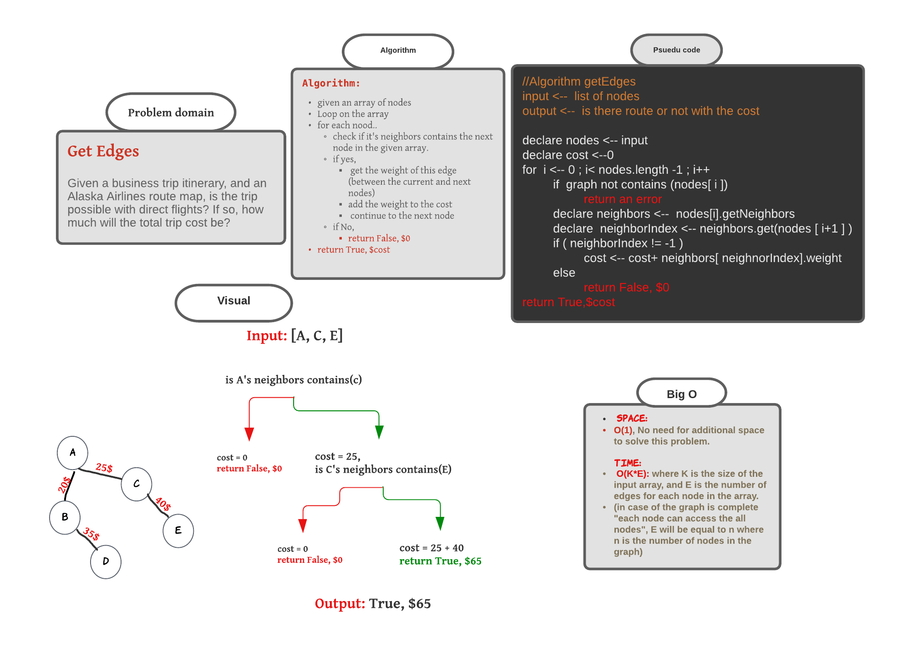

###### [back to main list of challenges](https://github.com/MHD22/data-structures-and-algorithms-401#readme)

# Get Edges

[Source code =>](https://github.com/MHD22/data-structures-and-algorithms-401/blob/main/Data-Structures/graph/app/src/main/java/graph/Graph.java)

# Challenge Summary

Given a business trip itinerary, and an Alaska Airlines route map, is the trip possible with direct flights? If so, how much will the total trip cost be?

## API

* **`getEdges([node1,node2, ...])`** this method should take an array of nodes to check if there connection between them and return true with the cost, or false with 0 as the cost.

## Approach & Efficiency

***Algorithm: getEdges([node1,node2, ...]):***

* given an array of nodes
* Create the variable cost to be 0
* loop on this array
* for each node:
  * check if it's neighbors list contains the next node of the given array 
  * if yes,
    * get the weight of this edge( between the current and the next nodes)
    * add the weight to the cost
  * if no,
    * return False, $0
* return True, $cost

***Efficiency:***

* `Time`: 

`O(V+E)`:
where `V` is the number of nodes in the given array, where we need to visit them all.

And `E` is the number of Edges in the all given nodes.

* `space`:

`O(1)`:
No need to additional space to solve this problem.

## Whiteboard Process

