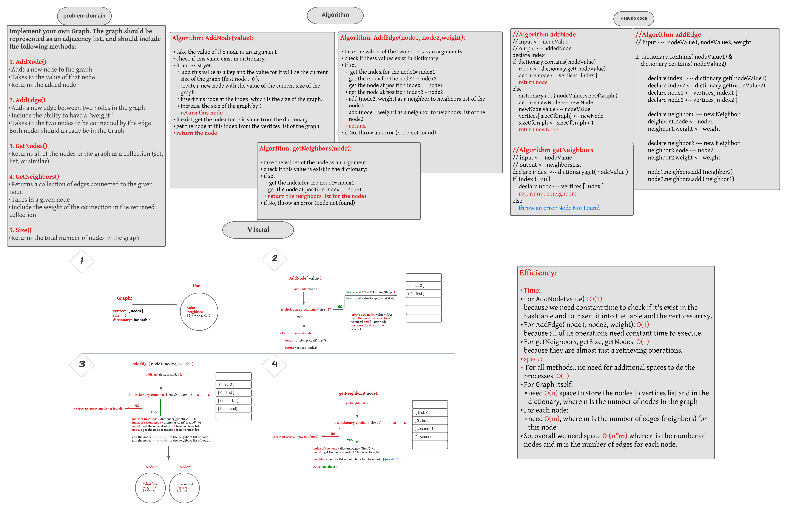

###### [back to main list of challenges](https://github.com/MHD22/data-structures-and-algorithms-401#readme)

# Graph

[Source code =>]()

# Challenge Summary

Implement a Graph data structure with the main methods to implement it.

## API

* **`AddNode(value)`** this method should take the value of node to be added  as an argument, and will return node which added.
***NOTE:*** if the node is already exist will return it directly.

* **`AddEdge(nodeName1, nodeName2, weight)`**: this method should take the name for two nodes and the weight between them, then will add edge between these nodes.
***NOTE:*** if one or both of the nodes not exist in the graph an exception `NodeNotFoundException` will be thrown.

* **`getNeighbors(nodeName)`**: this method should take the nodeName as an argument, then return the list of neighbors for this node
***NOTE:*** if the node doesn't exist in the graph an exception `NodeNotFoundException` will be thrown.

* **`getNodes()`**: this method will retrieve a list of all nodes of the graph.
***NOTE:*** if the graph is empty, will return *"null"*

* **`getSize()`**: will return the proper size of the graph(Number of nodes in the graph).

## Approach & Efficiency

***Algorithm: AddNode(value):***

* take the value of the node as an argument
* check if this value exist in dictionary:
* if not exist yet..
  * add this value as a key and the value for it will be the current size of the graph (first node .. 0 ),
  * create a new node with the value of the current size of the graph.
  * insert this node at the index  which is the size of the graph.
  * increase the size of the graph by 1
  * return this node
* if exist, get the index for this value from the dictionary.
* get the node at this index from the vertices list of the graph
* return the node

***Algorithm: AddEdge(node1, node2,weight):***

* take the values of the two nodes as an arguments
* check if thess values exist in dictionary:
* if so,
  * get the index for the node1= index1
  * get the index for the node2  = index2
  * get the node at position index1 = node1
  * get the node at position index2 = node2
  * add (node2, weight) as a neighbor to neighbors list of the node1
  * add (node1, weight) as a neighbor to neighbors list of the node2
  * return
* if No, throw an error (node not found)

***Algorithm: getNeighbors(node):***

* take the values of the node as an argument
* check if this value is exist in the dictionary:
* if so,
  * get the index for the node1= index1
  * get the node at position index1 = node1
  * return the neighbors list for the node1
* if No, throw an error (node not found)

***Efficiency:***

`Time`: 

* For `AddNode(value)` : `O(1)`because we need constant time to check if it's exist in the hashtable and to insert it into the table and the vertices array.
* For AddEdge( node1, node2, weight): `O(1)`because all of its operations need constant time to execute.
* For getNeighbors, getSize, getNodes: `O(1)`because they are almost just a retrieving operations.

`space`:

* For all methods.. no need for additional spaces to do the processes. `O(1)`
* For `Graph` itself: 
need `O(n)` space to store the nodes in vertices list and in the dictionary, where `n` is the number of nodes in the `graph`

* For each node:
need `O(m)`, where `m` is the number of edges (neighbors) for this node

* So, overall we need space `O(n*m)` where `n` is the number of nodes and `m` is the number of edges for each node. 

## Whiteboard Process

