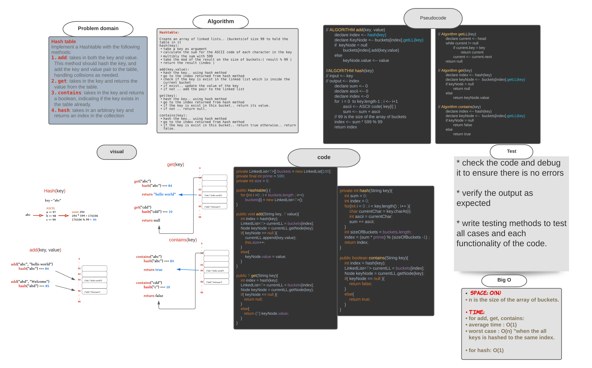

###### [back to main list of challenges](https://github.com/MHD22/data-structures-and-algorithms-401#readme)

# Hashtables
[Source code =>](https://github.com/MHD22/data-structures-and-algorithms-401/blob/main/Data-Structures/hashtable/app/src/main/java/hashtable/Hashtable.java)

Implement a hashtable to store (key, value) pairs and retrieve the value in a fast way.

## Challenge

write the Java code to implement the hashtable and all its methods( add, get, contains, hash)
to store and retrieve data from this data structure in time complexity `O(1)`
where its method must do the following:

* `add`: takes in both the key and value. This method should hash the key, and add the key and value pair to the table, handling collisions as needed.
* `get`: takes in the key and returns the value from the table.
* `contains`: takes in the key and returns a boolean, indicating if the key exists in the table already.
* `hash`: takes in an arbitrary key and returns an index in the collection

## Approach & Efficiency

* ***Approach:***

Create an array of linked lists.. (buckets)of size `99` to hold the table in it

`hash(key):`

take a key as argument
calculate the sum for the ASCII code of each character in the key 
multibly the sum with `599`, where 599 is a prime number.
take the modulu of the result on the size of buckets:  `( result % 99 )`
return the final result ( index )

`add(key,value):`

hash the key.. using `hash` method 
go to the index returned from hash method in the buckets array.
check if the key is exist in the linked list which is inside the current bucket
if exist.. update the value of this key
if not .. add the pair(key, value) to the linked list

`get(key):`
hash the key.. using hash method 
go to the index returned from hash method
if the key is exist in this bucket.. return its value.
if not .. return null.

`contains(key):`
hash the key.. using hash method 
go to the index returned from hash method
if the key is exist in this bucket.. return true otherwise.. return false.

* ***Efficiency:***

***space: O(N)***

where n is the size of the array of buckets.

***time:*** 

* for add, get, contains:
  * average time : `O(1)`
  * worst case : `O(n)` "when the all keys is hashed to the same index."
* for hash: `O(1)`

## API

* `add(key, value)`: key must be a string, value can be any type of data.
this method will take the key and search in the hashtable on it, if the key is exist, it will update the value of it. else, will add the key and value as a new pair to the hashtable

* `get(key)`: key must be a string.
this method will take the key and search on it inside the hashtable. If the key is exist will return the value of it. else, will return null.

* `contains(key)`: key must be a string.
this method will take the key and search on it inside the hashtable. If the key is exist will return true. else, will return false.

## Solution ( whiteboared ):

