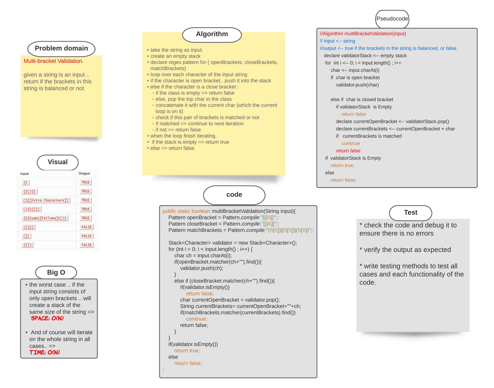

###### [back to main list of challenges](https://github.com/MHD22/data-structures-and-algorithms-401#readme)

# Multi Bracket validator

[Source code =>](https://github.com/MHD22/data-structures-and-algorithms-401/blob/main/challenges/utilities/app/src/main/java/utilities/MultiBracketValidation.java)

# Challenge Summary

the function should take a string as its only argument, and should return a boolean representing whether or not the brackets in the string are balanced.

## Challenge Description

Need add the following method:

* `multiBracketValidation(input)`
this method should take an input as a string.. and check if this string is balanced or not.

* Balanced mean each open bracket inside the string must has an appropriete close bracket.
the bracket types:

* Round Brackets : `()`
* Square Brackets : `[]`
* Curly Brackets : `{}`

## Approach & Efficiency

* take the string as input.
* create an empty stack 
* declare regex pattern for ( openBrackets, closeBrackets, matchBrackets)
* loop over each character of the input string 
* if the character is open bracket.. push it into the stack
* else if the character is a close bracket : 
  * if the class is empty => return false
  * else, pop the top char in the class
  * concatenate it with the current char (which the current loop is on it)
  * check if this pair of brackets is matched or not
  * if matched => continue to next iteration
  * if not => return false
* when the loop finish iterating.
* if the stack is empty => return true
* else => return false.

## Solution

