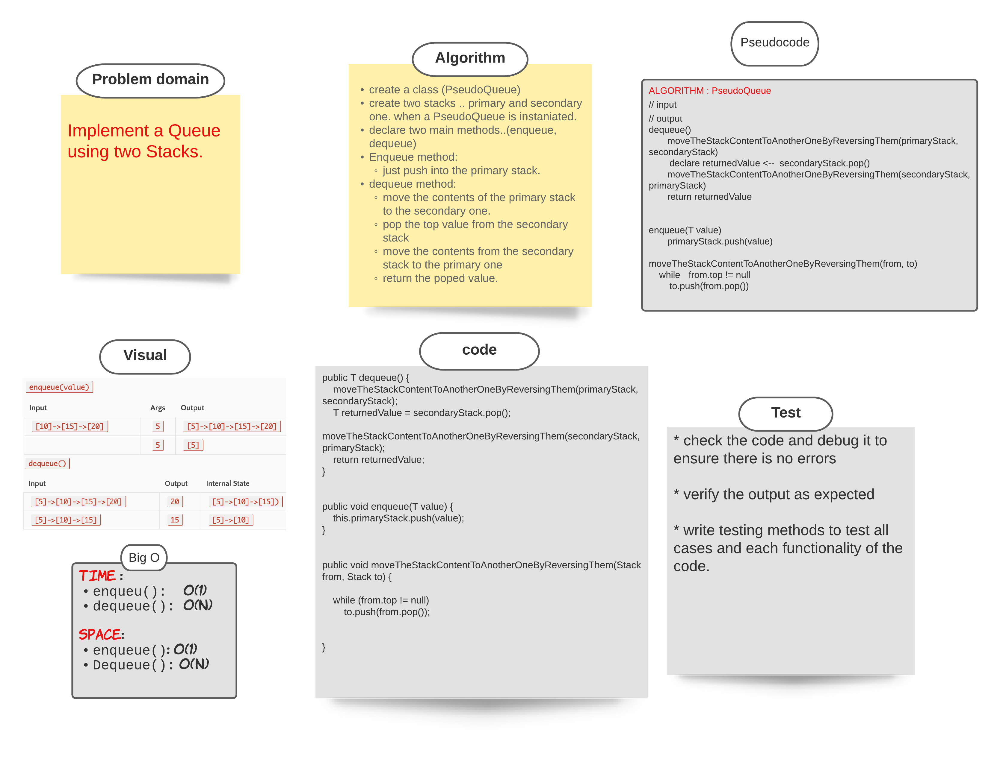

###### [back to main list of challenges](https://github.com/MHD22/data-structures-and-algorithms-401#readme)

# PseudoQueue

[Source code =>](https://github.com/MHD22/data-structures-and-algorithms-401/blob/main/Data-Structures/stacksandqueues/app/src/main/java/stacksandqueues/PseudoQueue.java)

# Challenge Summary

Implement a queue using two stacks only with methods of( pop, push, peek) 

## Challenge Description

Need add the following methods:

* `dequeue()`
this method should retrieve the first element of the queue (front).
* `enqueue(value)`
this method should add the value to the end of the queue (rear).

## Approach & Efficiency

* create a class (PseudoQueue)
* create two stacks .. primary and secondary one. when a PseudoQueue is instaniated.
* declare two main methods..(enqueue, dequeue)
* Enqueue method:
  * just push into the primary stack.
* dequeue method:
  * move the contents of the primary stack to the secondary one.
  * pop the top value from the secondary stack
  * move the contents from the secondary stack to the primary one
  * return the poped value.

## Solution

