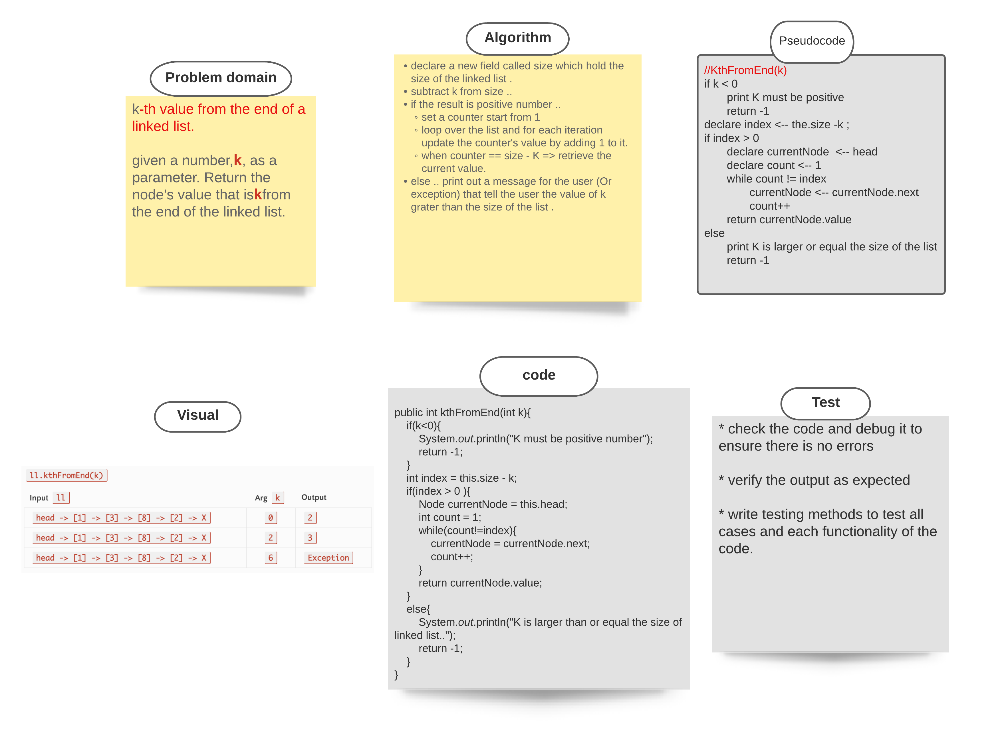

###### [back to main list of challenges](https://github.com/MHD22/data-structures-and-algorithms-401#readme)

# Singly Linked List, KthFromEnd(k)

[Source code =>](https://github.com/MHD22/data-structures-and-algorithms-401/blob/ll-kth-from-end/Data-Structures/linkedList/app/src/main/java/linkedList/LinkedList.java)

# Challenge Summary

declare a method to find the element of the list that is `K` from the end of the list. 

## Challenge Description

Need add the following methods:

* `KthFromEnd(k)`
K must be smaller than the size of the list. 
this method should search during the list and retrieve the element that K from the end of the list.

## Approach & Efficiency

* declare a new field called size which hold the size of the linked list.
subtract k from size and store the result in index.. 
if the index is positive number .. 
set a counter start from 1 
loop over the list and for each iteration update the counter's value by adding 1 to it.
when counter == index (size - K ) => retrieve the current value.
else .. print out a message for the user (Or exception) that tell the user the value of k grater than the size of the list .

## Solution

