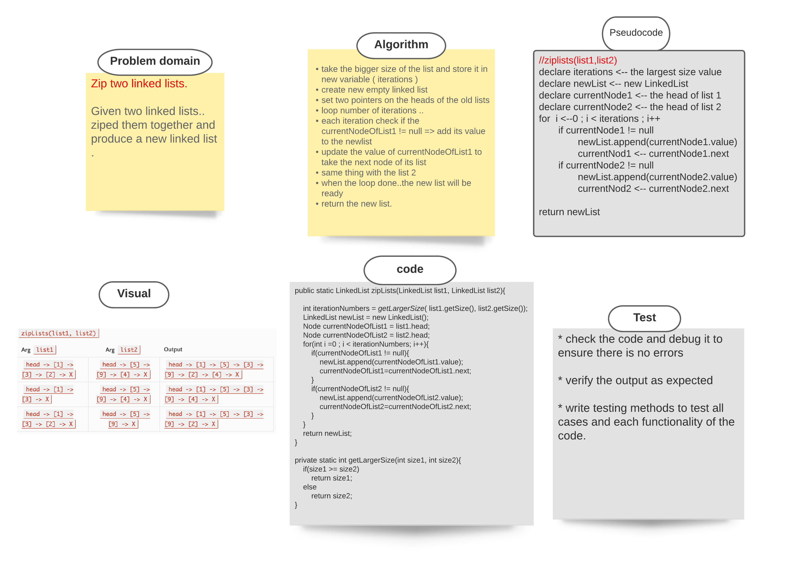

###### [back to main list of challenges](https://github.com/MHD22/data-structures-and-algorithms-401#readme)

# Singly Linked List, zipLists(list1, list2)

[Source code =>](https://github.com/MHD22/data-structures-and-algorithms-401/blob/ll-zip/Data-Structures/linkedList/app/src/main/java/linkedList/LinkedList.java)

# Challenge Summary

declare a method to zipped two list together into new one. 

## Challenge Description

Need add the following methods:

* `zipLists(list1, list2)`
this method should take two linked list and produce a new one which contain the all elements of them.

## Approach & Efficiency

* take the bigger size of the list and store it in new variable ( iterations )
* create new empty linked list
* set two pointers on the heads of the old lists
* loop number of iterations ..
  * each iteration check if the currentNodeOfList1 != null => add its value to the newlist
  * update the value of currentNodeOfList1 to take the next node of its list
  * same thing with the list 2
* when the loop done..the new list will be ready
* return the new list.

## Solution

