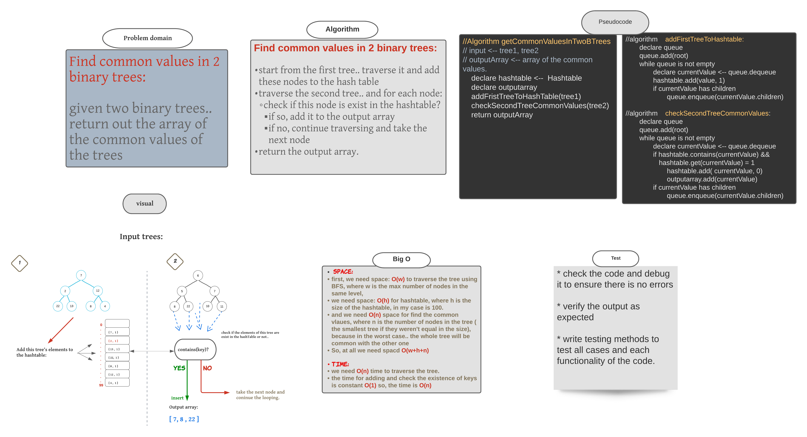

###### [back to main list of challenges](https://github.com/MHD22/data-structures-and-algorithms-401#readme)

# First Repeated Word

[Source code =>]()

# Challenge Summary

find the common values in two binary trees.

## API

`findCommonValuesInTwoBinaryTrees(tree1, tree2);` tree1 and tree2 is binary trees, this method will retrun the list of integers which hold the all common values in the both trees.

## Approach & Efficiency

***Find common values in 2 binary trees:***

* start from the first tree.. traverse it and add these nodes to the hash table
* traverse the second tree.. and for each node:
* check if this node is exist in the hashtable?
  * if so, add it to the output array
  * if no, continue traversing and take the next node
* return the output array.

***Efficiency:***

**space:**

* first, we need space: `O(w)` to traverse the tree using `BFS`, where `w` is the max number of nodes in the same level,

* we need space: `O(h)` for `hashtable`, where `h` is the size of the hashtable, in my case is 100.

* and we need `O(n)` space for find the common vlaues, where `n` is the number of nodes in the tree ( the smallest tree if they weren't equal in the size), because in the worst case.. the whole tree will be common with the other one
So, at all we need `spacd O(w+h+n)`

* **time:** 

* we need `O(n)` time to traverse the tree.
the time for adding and check the existence of keys is constant `O(1)` so, the time is `O(n)` 

## Whiteboard Process

