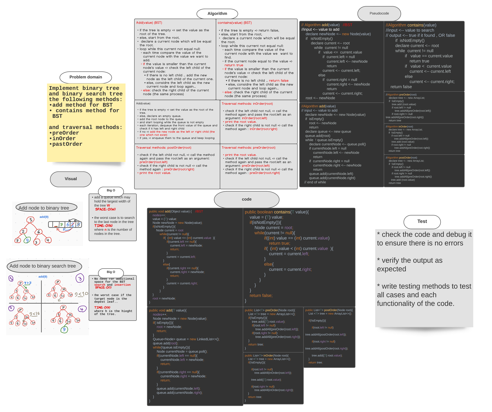

###### [back to main list of challenges](https://github.com/MHD22/data-structures-and-algorithms-401#readme)

# Trees

[Source code =>](https://github.com/MHD22/data-structures-and-algorithms-401/tree/main/Data-Structures/tree/app/src/main/java/tree)

# Challenge Summary

Implement Binary tree, and Binary Search Tree (BST)

## Challenge Description

Need add the following method:

* `add(value)`
this method should take an input value.. and add it to the tree in the first appropriate place.
* `add(value)` for (BST)
this method should take an input value.. and add it to the tree in the first appropriate place by apply the binary tree search.
* `contains(value)` for (BST)
this method should take an input value.. and return true if the value exist in the binary search tree, otherwise.. return false.
* `preOrder(root)` 
this method should traverse the tree in ***PreOreder*** way and return a list of values of the tree.
* `inOrder(root)` 
this method should traverse the tree in ***InOrder*** way and return a list of values of the tree.
* `postOrder(root)` 
this method should traverse the tree in ***PostOreder*** way and return a list of values of the tree.

## Approach & Efficiency

***Add(value) (BST)***

* if the tree is empty => set the value as the root of the tree.
* else, start from the root,
* declare a current node which will be equal the root.
* loop while this current not equal null:
* each time compare the value of the current node with the value we want to add.
  * if the value is smaller than the current node's value => check the left child of the current node:
    * if there is no left child .. add the new node as the left child of the current one.
    * else, considre the left child as the new current node and loop again...
  * else: check the right child of the current node (the same process)

###### __________

***Add(value) ***

* if the tree is empty => set the value as the root of the tree.
* else, declare an empty queue.
* add the root node to the queue
* and start looping while the queue is not empty
* each iteration, dequeue the front value of the queue and check if it has left and right child
  * if no => add the new node as the left or right child (the one which not exist)
  * if yes, => enqueue them to the queue and keep looping 

###### __________

***contains(value) (BST)***

* if the tree is empty => return false,
* else, start from the root,
* declare a current node which will be equal the root.
* loop while this current not equal null:
* each time compare the value of the current node with the value we  want to find.
  * if the current node equal to the value => return true
  * if the value is smaller than the current node's value => check the left child of the current node:
    * if there is no left child .. return false
    * else, considre the left child as the new current node and loop again...
  * else: check the right child of the current node (the same process)

###### __________

***Traversal methods: inOrder(root)*** 

* check if the left child not null, => call the method again and pass the root.left as an argument: inOrder(root.left)
* print the root value.
* check if the right child is not null => call the method again : inOrder(root.right)

###### __________

***Traversal methods: postOrder(root) ***

* check if the left child not null, => call the method again and pass the root.left as an argument: preOrder(root.left)
* check if the right child is not null => call the method again : preOrder(root.right)
* print the root value.

###### __________

***Traversal methods: preOrder(root) ***

* print the root value.
* check if the left child not null, => call the method again and pass the root.left as an argument: preOrder(root.left)
* check if the right child is not null => call the method again : preOrder(root.right)

###### __________

## Solution

