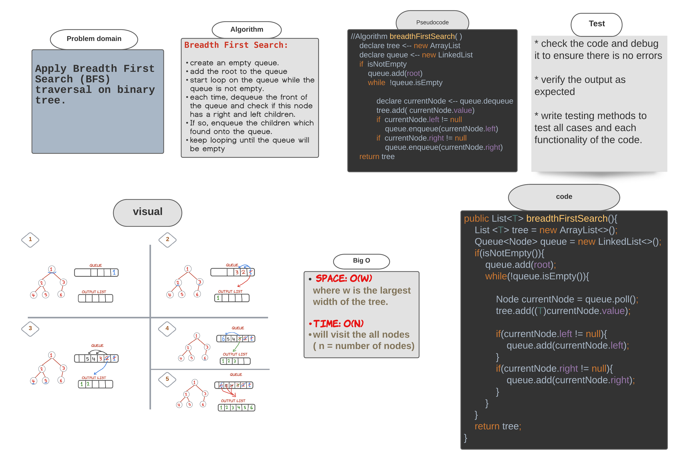

###### [back to main list of challenges](https://github.com/MHD22/data-structures-and-algorithms-401#readme)

# Trees: Breadth First Search Traversal method 

[Source code =>](https://github.com/MHD22/data-structures-and-algorithms-401/blob/main/Data-Structures/tree/app/src/main/java/tree/BinaryTree.java)

# Challenge Summary

Implement a method to traverse the binary tree in A BFS order.

## Challenge Description

Need add the following method:

* `breadthFirstSearch()`
this method should return list which contain the all values of the tree in the BFS order.

## Approach & Efficiency

***Breadth First Search (BFS):***

* create an empty queue.
* add the root to the queue
* start loop on the queue while the queue is not empty.
* each time, dequeue the front of the queue and check if this node has a right and left children.
* If so, enqueue the children which found onto the queue.
* keep looping until the queue will be empty

## Solution

