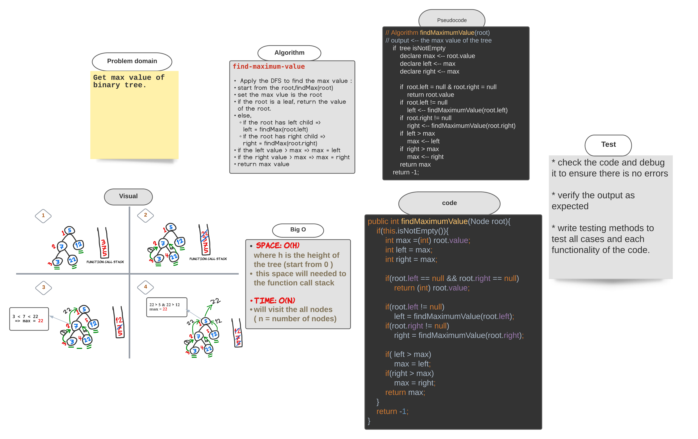

###### [back to main list of challenges](https://github.com/MHD22/data-structures-and-algorithms-401#readme)

# Trees: FindMaximumValue 

[Source code =>](https://github.com/MHD22/data-structures-and-algorithms-401/blob/main/Data-Structures/tree/app/src/main/java/tree/BinaryTree.java)

# Challenge Summary

Implement a method to find the max value of a binary tree.

## Challenge Description

Need add the following method:

* `finMaximumValue(root)`
this method should return an integer number which is the max value of the tree.

## Approach & Efficiency

***find-maximum-value***

**Apply the DFS to find the max value :**

* start from the root,findMax(root)
* set the max vlue is the root
* if the root is a leaf, `return` the value of the root.
* else, 
  * if the root has left child => left = findMax(root.left)
  * if the root has right child => right = findMax(root.right)
  * if the left value > max => max = left
  * if the right value > max => max = right
  * return max value

## Solution

