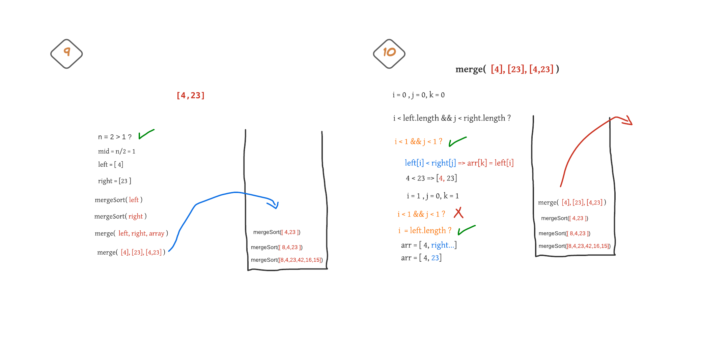
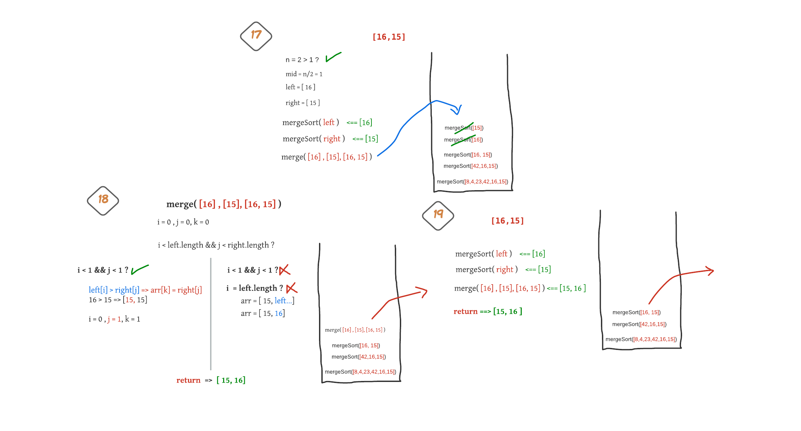
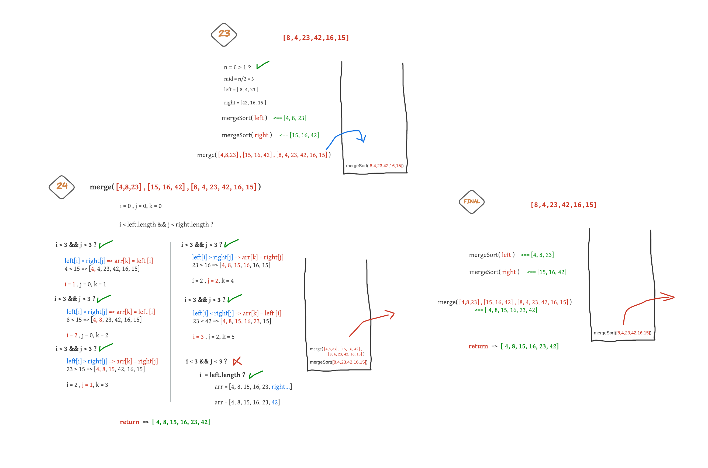

# Merge Sort Blog

## In this article will trace and explain how Merge sort works:

## Merge Sort: 

Merge Sort is a `Divide and Conquer` algorithm. It divides the input array into two halves, calls itself for the two halves, and then merges the two sorted halves. The `merge()` function is used for merging two halves. The `merge(leftArray, rightArray, array)` is a key process that assumes that `leftArray` and `rightArray` are **sorted** and merges the two sorted sub-arrays into one.

## Pseudocode:

```
ALGORITHM Mergesort(arr)
    DECLARE n <-- arr.length
           
    if n > 1
      DECLARE mid <-- n/2
      DECLARE left <-- arr[0...mid]
      DECLARE right <-- arr[mid...n]
      // sort the left side
      Mergesort(left)
      // sort the right side
      Mergesort(right)
      // merge the sorted left and right sides together
      Merge(left, right, arr)

ALGORITHM Merge(left, right, arr)
    DECLARE i <-- 0
    DECLARE j <-- 0
    DECLARE k <-- 0

    while i < left.length && j < right.length
        if left[i] <= right[j]
            arr[k] <-- left[i]
            i <-- i + 1
        else
            arr[k] <-- right[j]
            j <-- j + 1
            
        k <-- k + 1

    if i = left.length
       set remaining entries in arr to remaining values in right
    else
       set remaining entries in arr to remaining values in left
```

## Trace:

Sample Array: `[8,4,23,42,16,15]`

starting by pass the array to the method => `mergeSort([8,4,23,42,16,15])`

### step 1:


* in this step the array size is grater than 1 which is 6 so will divide this array into two halves (left and right)
* after deviding the array will recall the function and pass the left part of the array as an argument
* the callback stack will have the original and the left part of it as you can see in the figure above.

### step 2:


* in this step the array size is grater than 1 which is 3 so will divide this array into two halves (left and right)

* after deviding the array will recall the function and pass the left part of the array as an argument


### step 3,4:


* the array size is one .. so will retrieve it as it is and pop this callfunction from the callback stack.

* now the left part of the step 2 array .. will done, then call the function again with passing the right part this time as an argument. which is [4,23]


### step 5,6,7,8:


the input array now is [4,23]
divide it into two halves [4] , [23]
then, pass the left part [4] to the mergeSort function.. will return itself [4] because its size is one..

after that.. call the function again with the right part and 
the same for the right part.. will return [23]


### step 9,10:



we still inside the function with the array of [4,23]

now after the calls for the left and the right parts..

call the `merge` function which take the left and right and the original array as arguments like:
`merge(left, right, arr);`

the merge function will create three variables i, j, k

`i` will iterate on the left part of the array.

`j` will iterate on the right part of the array.

and `k` will iterate on the original array.

In this step the left and right sizes are one.

merge function will loop over the left and right arrays and compare the corresponding element of each of them with together while the both arrays is not reach to the end of themself.

each time will compare it and take the smallest element and add it to the original array ..then update the k and the index of which part pick the element by increasing them by one.

so, 4 is less than 23 => add 4 to the original array in index k (0)..
then update the indicies k = 1 , i = 1.

now will notice that the left part reach to the end, so will put all the rest element in the another part in the original array ..
in this case we only have 23 in the right part.. 
so add it to the original array in the index 1
now i will be equal 1, j = 1, k = 2

the two parts is merged .. then finally return the array which is `[4, 23]`

### step 11:


back again to the function of the array [ 4,23]
the left and right part is done.
the merge operation is also done and now the original array is updated to the [4, 23] ( in this case no changes on it)
now will retrun the array.. and pop the function from the stack.

### step 12,13,14:


back to the step 4.. we now done with the right part and will continue the progress.

we have in the function of the array [8,4,23]

the left part is done => [8]
the right part is done => [4,23]

now will merge them together.. merge(left, right, array)

* the first element of left is grater than the first one of right, so add the first element of right part(j=0) as the first element of the original array (k=0)
* update the indices (j=1, k=1)
* the first element of left (i=0) is less than the second element of the right (j=1), so add it as the second element of the original array (k=1)
* update the indices (i=1, k=2)
* the left part is reach to the end. so will add the rest elements of the right part to the original array.. [4,8,23]
* the merge process is done .. return the array back.


### step 15,16:


back to the step 1.. we now done with the left part and will continue the progress.

will recall the function mergeSort with the right part which is (42,16,15)

* then devide this new array into two halves again.. the left will be [42], and the right will be [16,15]

* as we see before .. the left part is simple because its size is one ..so will retrieve itself

* then pass the right part to the mergeSort function...

### step 17,18,19:



* frist of all divide the array [16,15] into two halves.
* call the function with the left part.. will return itself [16]
* the same for right part .. will return [15]
* merge them together:
  * the first of right is less than the first of left so add the first element of the right part first on the original array 
  k=0 <= j=0
  * update the values .. (i=0, j=1, k=1)
  * right part is finish, so add the left part to the original array.
  * done with merging and return back [15,16]
* the merge is done and the array updated to be [15,16]
* return it back and pop it from the stack


### step 20,21,22:


back to the step 16.. we now done with the left and right parts and will continue the progress by merging them.

* call the merge function ( [42],[15,16], [42,16,15])

* the first element of left(42) is grater than the first one of right(15), so add the first element of right part(j=0) as the first element of the original array (k=0)
* update the indices (j=1, k=1)

* the first element of left(42) is grater than the second element of right(16), so add the second element of right part(j=1) as the seconde element of the original array (k=1)
* update the indices (j=2, k=2)

* the right part is reach to the end. so will add the rest elements of the left part[42] to the original array.. [15,16,42]
* the merge process is done .. return the array back.
* return the array after updated..and pop the call for this function from the stack.


### step 20,21,22:



back to the step 15.. we now done with the left and right parts and will continue the progress by merging them.

* call the merge function ( [4,8,23],[15,16,42], [8,4,23,42,16,15])

* the first element of left(4) is less than the first one of right(15), so add the first element of left part(i=0) as the first element of the original array (k=0)
* update the indices (i=1, k=1)

* the second element of left(8) is less than the first element of right(15), so add the second element of left part(i=1) as the seconde element of the original array (k=1)
* update the indices (i=2, k=2)

* the third element of left(23) is grater than the first element of right(15), so add the first element of right part(j=0) as the third element of the original array (k=2)
* update the indices (j=1, k=3)

* the third element of left(23) is grater than the secont element of right(16), so add the second element of right part(j=1) as the forth element of the original array (k=3)
* update the indices (j=2, k=4)

* the third element of left(23) is less than the third element of right(42), so add the third element of left part(j=2) as the fifth element of the original array (k=4)
* update the indices (i=3, k=5)

* the left part is reach to the end. so will add the rest elements of the right part[42] to the original array.. [4,8,15,16,23,42]
* the merge process is done .. return the array back.
* return the array after updated..and pop the call for this function from the stack.

#### finish:

The callBack stack now is empty..and 
***The output (sorted) array is:***
`[4,8,15,16,23,42]`


## implementation (Java code)

***mergeSort(arr)***

```java
public static int[] mergeSort(int[] arr){
        int n = arr.length;
        if(n>1){
         int mid = n/2;
         int[] left = Arrays.copyOfRange(arr,0,mid);
         int[] right = Arrays.copyOfRange(arr, mid,n);
         left  = mergeSort(left);
         right = mergeSort(right);
         arr = merge(left, right, arr);
        }
        return arr;
    }

```

***merge(left, right, arr)***

```java

private static int[] merge(int[] left, int[] right, int[] arr) {

        int i=0, j=0, k=0;
        while(i < left.length && j < right.length){
            if( left[i] <= right[j] ){
                arr[k] = left[i];
                i++;
            }
            else{
                arr[k] = right[j];
                j++;
            }
            k++;
        }
        if(i == left.length ){
            while( j < right.length){
                arr[k] = right[j];
                j++;
                k++;
            }
        }
        else{
            while( i < left.length){
                arr[k] = left[i];
                i++;
                k++;
            }
        }
        return arr;
    }
```

## Efficency

Time complexity of Merge Sort is  `θ(nLogn)` in all 3 cases (worst, average and best) as merge sort always divides the array into two halves and takes linear time to merge two halves.

Space: `O(n)`
It needs an additional space for storing the left and right halves of the original array.

