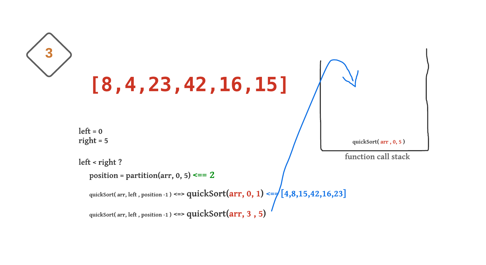

# Quick Sort Blog

## In this article will trace and explain how Quick sort works:

## Quick Sort: 

Like **Merge Sort**, `QuickSort` is a ***Divide and Conquer algorithm***. It picks an element as `pivot` and partitions the given array around the picked `pivot`. There are many different versions of `quickSort` that pick `pivot` in different ways. 

1. Always pick first element as `pivot`.
2. Always pick last element as `pivot` (implemented below)
3. Pick a random element as `pivot`.
4. Pick median as `pivot`.

The **key** process in quickSort is `partition()`. Target of partitions is, given an array and an element x of array as `pivot`, put x at its correct position in sorted array and put all smaller elements (smaller than x) before x, and put all greater elements (greater than x) after x. ***All this should be done in linear time***.


## Pseudocode:

```
ALGORITHM QuickSort(arr, left, right)
    if left < right
        // Partition the array by setting the position of the pivot value 
        DEFINE position <-- Partition(arr, left, right)
        // Sort the left
        QuickSort(arr, left, position - 1)
        // Sort the right
        QuickSort(arr, position + 1, right)

ALGORITHM Partition(arr, left, right)
    // set a pivot value as a point of reference
    DEFINE pivot <-- arr[right]
    // create a variable to track the largest index of numbers lower than the defined pivot
    DEFINE low <-- left - 1
    for i <- left to right do
        if arr[i] <= pivot
            low++
            Swap(arr, i, low)

     // place the value of the pivot location in the middle.
     // all numbers smaller than the pivot are on the left, larger on the right. 
     Swap(arr, right, low + 1)
    // return the pivot index point
     return low + 1

ALGORITHM Swap(arr, i, low)
    DEFINE temp;
    temp <-- arr[i]
    arr[i] <-- arr[low]
    arr[low] <-- temp
```

## Trace:

Sample Array: `[8,4,23,42,16,15]`

starting by pass the array and the left and right of this array (frist and last indices) to the method => `quickSort([8,4,23,42,16,15], 0, 5)`

### step 1:


passed the array [8,4,23,42,16,15], with the left index = 0 and right = 5,
left is less than right so will partition the array and get the pivot position as following: 

consider the pivot is the last index (right) which is 15 
set the low as left -1 ==> (-1)

start looping from left to right:
* first iteration : the first element is 8 and it is less than the pivot (15) so will increase the low by 1 => (0) and swap the first element with the element in the (low position) .. in this case i =0 and low =0 .. nothing will happen.

* second iteration: the second element (i=1) is 4 and it's less than the pivot (15)so will increase the low by 1 => (1) and swap the second element with the element in the (low position) .. in this case i = 1 and low = 1 .. nothing will happen.

* i = 2: the current element is 24 and it's grater than the pivot.. so continue the looping without update the low index.

* i = 3: the current element is 42 and it's grater than the pivot.. so continue the looping without update the low index.

* i = 4: the current element is 16 and it's grater than the pivot.. so continue the looping without update the low index.

* i = 5: end the loop because i = right.

* now will change the pivot(15) element with the element in the position (low + 1) (23) .. in this case will put all the elements which are less than the pivot (15) on the left of it and all the elements which are grater than the pivot on the right.

* the array will be [8,4,15,42,16,23]

* return the position of the pivot.. which is (low +1) => 2

Now, we have the position of the pivot.. so will call the quickSort function again for the part on the left of the pivot ( from left to the position -1 ) and the one on the right of it( from the position +1 to the right).

* will start with the left part..

`quickSort(arr, 0, 1); ` 


<hr>

### step 2:


passed the array [8,4,15,42,16,23], with the left index = 0 and right = 1,
left is less than right so will partition the array and get the pivot position as following: 

consider the pivot is the right index which is 4 
set the low as left -1 ==> (-1)

start looping from left to right:

* i = 0: the current element is 8 and it's grater than the pivot.. so continue the looping without update the low index.

* i = 1: end the loop because i = right.

* now will change the pivot(4) with the element in the position (low + 1) (8) .. in this case will put all the elements which are less than the pivot (4) on the left of it and all the elements which are grater than the pivot on the right.

* the array will be [4,8,15,42,16,23]

* return the position of the pivot.. which is (low +1) => 0

Now, we have the position of the pivot.. so will call the quickSort function again for the part on the left of the pivot ( from left to the position -1 ) and the one on the right of it( from the position +1 to the right).

`quickSort(arr, 0, -1); `  (Note: the this function in this case will do nothing because the left is not less than the right.. 0 > -1 )

`quickSort(arr, 1, 1);`   (Note: the this function in this case will do nothing because the left is not less than the right.. 1 = 1 )

this function now is done and will popped from the stack .. the array after this function is done is: `[4,8,15,42,16,23]`

<hr>

### step 3:



* back to the step 1.. the left part of the pivot is done .. and now will call the function of the right part: `quickSort(arr, 3, 5);`


<hr>

### step 4:


passed the array [4,8,15,42,16,23], with the left index = 3 and right = 5,
left is less than right so will partition the array and get the pivot position as following: 

consider the pivot is the right index which is `23` 
set the low index as left -1 ==> (2)

start looping from left to right:

* i = 3: the current element is 42 and it's grater than the pivot.. so continue the looping without update the low index.

* i = 4: the current element is 16 and it's less than the pivot (23) so will increase the low by 1 => (3) and swap the current element (16) with the element in the low position (42) .. the array will be after updated: [4,8,15,16,42,23]

* i = 5: end the loop because i = right.

* now will change the pivot(23) with the element in the position (low + 1) (42) .. in this case will put all the elements which are less than the pivot (23) on the left of it and all the elements which are grater than the pivot on the right.

* the array will be [4,8,15,16,23,42]

* return the position of the pivot.. which is (low +1) => 4

Now, we have the position of the pivot.. so will call the quickSort function again for the part on the left of the pivot ( from left to the position -1 ) and the one on the right of it( from the position +1 to the right).

`quickSort(arr, 3, 3); `  (Note: the this function in this case will do nothing because the left is not less than the right.. 3 = 3 )

`quickSort(arr, 5, 5);`   (Note: the this function in this case will do nothing because the left is not less than the right.. 5 = 5 )

this function now is done and will popped from the stack .. the array after this function is done is: `[4,8,15,16,23,42]`

<hr>

### step 5:


* back to the step 3.. the right part of the pivot is done .. and now we finish running the whole function.
* the function will pooped from the stack.. 
* the stack is empty now..So we finish the sorting process.
* the array now is: `[4,8,15,16,23,42] `


<hr>

## implementation (Java code)

***quickSort(arr, left, right)***

```java
public int[] quickSort(int[] arr, int left, int right){

        if(left < right ){
            int position = partition(arr, left,right);
            quickSort(arr, left, position -1 );
            quickSort(arr,position +1, right );

        }
        return arr;
    }

```

***partition(arr, left, right)***

```java
private int partition(int[] arr, int left, int right) {
        int pivot = arr[right];
        int low = left-1 ;
        int i;
        for( i = left; i< right; i++){
            if(arr[i] <= pivot){
                low++;
                swap(arr, low, i);
            }
        }
        swap(arr, low+1, right);
        return low+1;
    }

```

***swap(arr, first, second)***

```java
private void swap(int[] arr, int first, int second) {
        int temp = arr[first];
        arr[first]  = arr[second];
        arr[second] = temp;
    }
```

## Efficency

* Time complexity:

`Worst Case:` `O(n^2)` The worst case occurs when the partition process always picks greatest or smallest element as pivot. If we consider above partition strategy where last element is always picked as pivot, the worst case would occur when the array is ***already sorted*** in increasing or decreasing order, because each time will cut only the pivot and return the array without the pivot.

`Best Case:` `O(nlogn)` The best case occurs when the partition process always picks the middle element as pivot, because each time will divide the array into almost two equal halves.

* Space:

The space complexity is calculated based on the space used in the recursion stack. The worst case space used will be `O(n)`.
where getting a sorted list, we need to make n recursive calls.